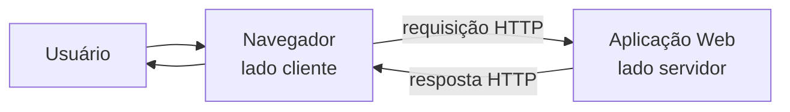
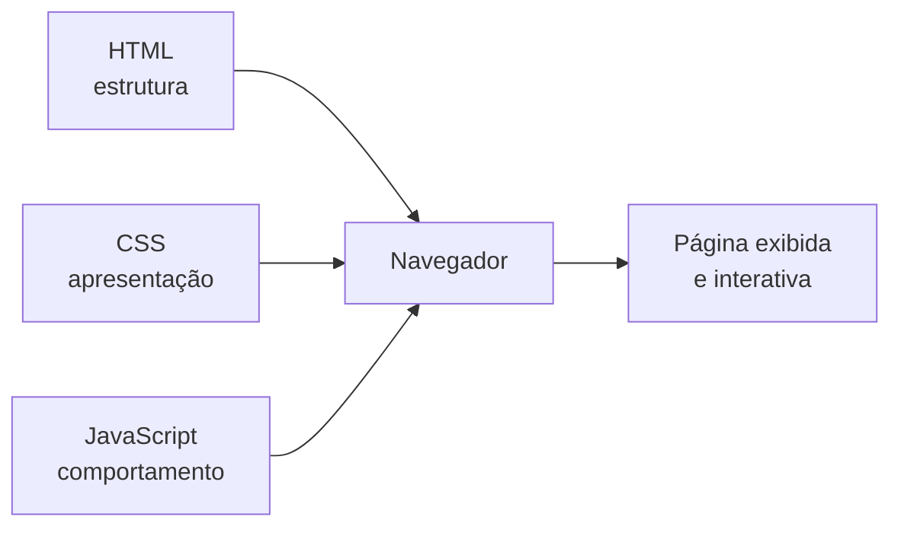
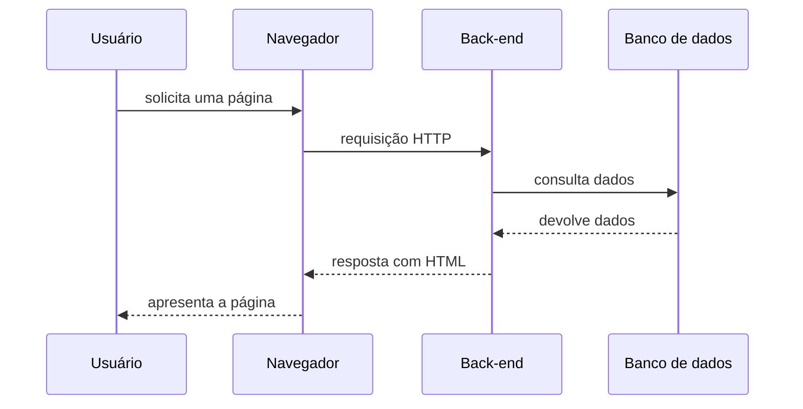
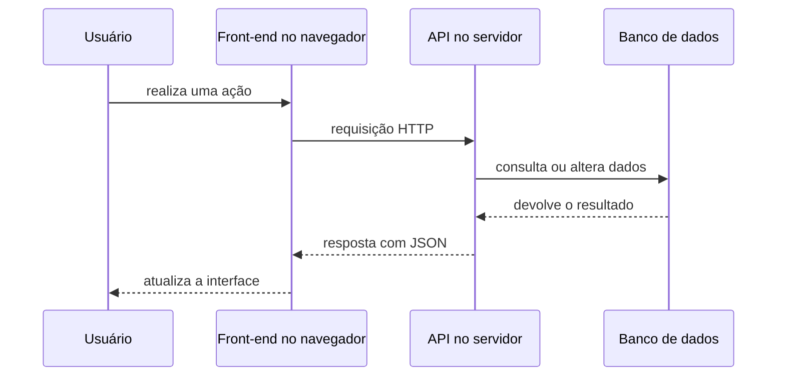

# Introdução ao desenvolvimento Web

Quando abrimos um site, o navegador conversa com computadores que podem estar muito longe. Esta apostila apresenta as partes dessa comunicação e mostra onde trabalham o front-end e o back-end.

## Índice remissivo

1. [Internet, Web, sites e aplicações](#internet-web)
2. [Uma breve história da Web](#historia-web)
3. [Arquitetura cliente-servidor](#cliente-servidor)
4. [O papel do navegador](#navegador)
5. [Primeiro contato com HTTP](#http)
6. [HTML, CSS e JavaScript](#html-css-javascript)
7. [Como o front-end é construído](#frontend)
8. [Como o back-end é construído](#backend)
9. [Como front-end e back-end trabalham juntos](#integracao)
10. [Sites estáticos e aplicações dinâmicas](#estatico-dinamico)
11. [Possibilidades de carreira](#carreiras)
12. [Padrões e fontes de consulta](#fontes)
13. [Quadro de consulta rápida](#consulta-rapida)

<a id="internet-web"></a>

## 1. Internet, Web, sites e aplicações

**Internet** e **Web** não são a mesma coisa.

- A **Internet** é a rede mundial que conecta computadores e outras redes.
- A **Web** é um serviço que usa essa rede para disponibilizar páginas e aplicações ligadas por endereços e links.

A Internet também é usada por outros serviços, como e-mail, chamadas de vídeo e jogos on-line. A Web é apenas uma de suas utilizações.

Alguns termos importantes:

| Termo | Significado simples |
|---|---|
| Página Web | Um documento acessado pelo navegador. |
| Site | Um conjunto de páginas e recursos relacionados. |
| Aplicação Web | Um sistema acessado pelo navegador, geralmente com interação, processamento e dados. |
| Link ou hiperlink | Uma ligação que leva a outro recurso. |
| URL | O endereço de um recurso na Web. |

Um portal de notícias é um site. Um sistema de matrícula, uma loja virtual e um webmail são aplicações Web. Na prática, um mesmo projeto pode ter características de site e de aplicação.

<a id="historia-web"></a>

## 2. Uma breve história da Web

**WWW** significa *World Wide Web*, ou **Teia Mundial**. A palavra *web* significa teia. O nome representa a ideia de documentos e recursos conectados entre si por hiperlinks.

Em 1989, no CERN, o cientista britânico Tim Berners-Lee apresentou uma proposta para facilitar o compartilhamento de informações entre pesquisadores. Desse trabalho surgiram três bases da Web:

- **HTML**, para estruturar documentos;
- **URL**, para dar endereço aos recursos;
- **HTTP**, para realizar a comunicação.

O primeiro servidor e o primeiro site foram construídos no CERN no início da década de 1990. Depois, a Web passou de páginas simples de texto e links para aplicações completas, capazes de exibir vídeos, editar documentos, realizar compras e atender milhões de usuários.

<a id="cliente-servidor"></a>

## 3. Arquitetura cliente-servidor

Aplicações Web normalmente usam a arquitetura **cliente-servidor**.

- O **cliente** inicia a comunicação e solicita alguma coisa. Em nosso contexto, geralmente é o navegador do usuário.
- O **servidor** mantém uma aplicação disponível, recebe pedidos, executa o processamento necessário e envia respostas.



O servidor pode estar no mesmo computador durante o desenvolvimento. Em uma aplicação publicada, ele geralmente está em um computador remoto acessível pela Internet.

O código executado no cliente compõe o **front-end**. O código executado no servidor compõe o **back-end**. Os dois lados cooperam por meio de requisições e respostas.

### Exemplo: consultar um paciente

1. O usuário clica em **Buscar** no navegador.
2. O front-end envia uma requisição ao servidor.
3. O back-end verifica o pedido e consulta o banco de dados.
4. O servidor monta uma resposta.
5. O navegador processa a resposta e apresenta o resultado ao usuário.

<a id="navegador"></a>

## 4. O papel do navegador

O navegador, também chamado de **browser**, é mais do que um programa que mostra páginas. Chrome, Firefox, Edge e Safari são exemplos.

Em uma navegação comum, o browser:

1. recebe ou monta uma URL;
2. envia uma requisição HTTP;
3. recebe a resposta do servidor;
4. interpreta o HTML e organiza os elementos da página;
5. aplica as regras de CSS;
6. executa o JavaScript;
7. apresenta o resultado e permite a interação do usuário.



O navegador cria uma representação do HTML chamada **DOM** (*Document Object Model*). O JavaScript pode usar o DOM para localizar elementos, responder a cliques e alterar o conteúdo da página.

As ferramentas do desenvolvedor, abertas normalmente com `F12`, ajudam a inspecionar HTML, CSS, mensagens do JavaScript e requisições de rede.

<a id="http"></a>

## 5. Primeiro contato com HTTP

**HTTP** significa *Hypertext Transfer Protocol*, ou **Protocolo de Transferência de Hipertexto**. Um protocolo é um conjunto de regras para a comunicação.

O HTTP organiza a troca de mensagens entre cliente e servidor:

```text
cliente  -- requisição HTTP -->  servidor
cliente  <-- resposta HTTP ----  servidor
```

Uma requisição informa, entre outras coisas:

- o endereço do recurso;
- o método que representa a ação desejada;
- cabeçalhos com informações adicionais;
- em alguns casos, dados enviados ao servidor.

Dois métodos muito comuns são:

| Método | Uso básico |
|---|---|
| `GET` | Solicitar ou consultar um recurso. |
| `POST` | Enviar dados para processamento, como dados de um formulário. |

A resposta contém um código de status e pode transportar HTML, CSS, JavaScript, uma imagem ou dados em outro formato.

| Código | Significado básico |
|---:|---|
| `200 OK` | A requisição foi atendida. |
| `404 Not Found` | O recurso não foi encontrado. |
| `500 Internal Server Error` | O servidor encontrou um erro durante o processamento. |

Em `https://`, o **HTTPS** acrescenta proteção à comunicação por meio de criptografia. Isso é essencial para dados de acesso, pagamentos e informações pessoais.

HTTP é, por natureza, um protocolo sem memória entre requisições. Aplicações que precisam reconhecer um usuário empregam recursos como cookies e sessões, que serão estudados depois.

<a id="html-css-javascript"></a>

## 6. HTML, CSS e JavaScript

Uma **linguagem** é um conjunto de símbolos e regras usado para expressar informações ou instruções. No front-end, HTML, CSS e JavaScript possuem papéis diferentes.

### HTML: estrutura e hipertexto

**HTML** significa *HyperText Markup Language*, ou **Linguagem de Marcação de Hipertexto**.

- **Marcação**: etiquetas, chamadas de *tags*, indicam a função de cada parte do documento.
- **Hipertexto**: texto que pode possuir ligações para outros documentos ou recursos.

```html
<h1>Consultório Vida</h1>
<p>Atendimento de segunda a sexta.</p>
<a href="contato.html">Entre em contato</a>
```

HTML é uma linguagem de marcação, não uma linguagem de programação. Ela descreve títulos, parágrafos, links, imagens, formulários e outras partes do conteúdo.

### CSS: apresentação

**CSS** significa *Cascading Style Sheets*, ou **Folhas de Estilo em Cascata**. Ele controla cores, fontes, espaçamentos e a organização visual.

```css
h1 {
  color: darkblue;
}
```

CSS é uma linguagem de estilos, não uma linguagem de programação.

### JavaScript: comportamento

JavaScript é uma linguagem de programação. Ela permite responder a eventos, verificar dados, alterar a página e conversar com servidores sem recarregar todo o documento.

```javascript
const botao = document.querySelector("button");

botao.addEventListener("click", function () {
  alert("Botão clicado!");
});
```

HTML, CSS e JavaScript são lidos e processados pelo navegador durante a execução. Por isso, é comum dizer que são tecnologias interpretadas no browser. É importante apenas lembrar que elas não são o mesmo tipo de linguagem: HTML marca conteúdo, CSS define estilos e JavaScript programa comportamentos.

<a id="frontend"></a>

## 7. Como o front-end é construído

O **front-end** é a parte da aplicação que chega ao dispositivo do cliente e com a qual o usuário interage.

Sua base é:

- HTML para estrutura e conteúdo;
- CSS para apresentação;
- JavaScript para comportamento e interatividade.

Projetos maiores podem usar ferramentas que facilitam o desenvolvimento:

| Ferramenta | Uso comum |
|---|---|
| React | Biblioteca JavaScript para criar interfaces. |
| Vue | Framework JavaScript para interfaces. |
| Angular | Framework para aplicações front-end. |
| Bootstrap | Conjunto de componentes e estilos CSS prontos. |
| Tailwind CSS | Framework CSS baseado em classes utilitárias. |

Essas ferramentas melhoram a organização e a produtividade, mas o navegador continua trabalhando com HTML, CSS e JavaScript. Durante a preparação do projeto, os arquivos podem ser transformados e agrupados antes de chegar ao cliente.

Um bom front-end também considera legibilidade, diferentes tamanhos de tela, facilidade de uso e acessibilidade para pessoas com diferentes necessidades.

<a id="backend"></a>

## 8. Como o back-end é construído

O **back-end** é a parte da aplicação executada no servidor. O usuário não acessa diretamente seu código: ele percebe os resultados enviados pelo servidor.

Responsabilidades comuns do back-end incluem:

- receber e validar dados;
- aplicar as regras de negócio;
- autenticar usuários e controlar permissões;
- acessar bancos de dados;
- integrar outros sistemas;
- devolver páginas HTML ou dados, muitas vezes em JSON.

Uma **regra de negócio** é uma regra do problema que o sistema precisa respeitar. Por exemplo: uma consulta não pode ser marcada em um horário já ocupado.

Algumas tecnologias populares de back-end são:

| Linguagem | Exemplos de tecnologias associadas |
|---|---|
| PHP | Laravel e Symfony |
| JavaScript ou TypeScript | Node.js, Express e NestJS |
| Python | Django, Flask e FastAPI |
| Java | Spring |
| C# | ASP.NET Core |
| Ruby | Ruby on Rails |

A **aplicação servidora** precisa ficar em execução e disponível para receber requisições. Ela pode usar um servidor Web e normalmente se conecta a um banco de dados, como MySQL ou PostgreSQL.

O banco de dados guarda informações de forma organizada. O back-end faz a mediação: recebe o pedido, verifica se ele é permitido, consulta ou altera os dados e prepara a resposta. O navegador não deve conhecer a senha do banco nem se conectar diretamente a ele.

<a id="integracao"></a>

## 9. Como front-end e back-end trabalham juntos

Existem diferentes formas de organizar essa cooperação. Duas são muito comuns.

### O servidor devolve uma página pronta



O back-end monta o HTML e o envia ao navegador. Essa abordagem é chamada frequentemente de **renderização no servidor**.

### O servidor devolve dados para o front-end



Nesse caso, o front-end conversa com uma **API**, uma interface oferecida pelo back-end. **JSON** é um formato de texto muito usado para transportar dados.

Uma aplicação pode combinar as duas abordagens. O ponto principal é sempre observar onde cada parte é executada: o front-end no cliente e o back-end no servidor.

<a id="estatico-dinamico"></a>

## 10. Sites estáticos e aplicações dinâmicas

Um **site estático** entrega arquivos preparados anteriormente. O mesmo conteúdo costuma ser enviado a todos os visitantes até que alguém altere esses arquivos.

Uma **aplicação dinâmica** monta ou modifica a resposta com base em dados, regras e ações do usuário. Um sistema de matrícula, por exemplo, mostra informações diferentes para cada estudante.

| Estático | Dinâmico |
|---|---|
| Conteúdo previamente criado | Conteúdo produzido ou atualizado durante o uso |
| Pode usar apenas HTML, CSS e JavaScript | Geralmente possui back-end e banco de dados |
| Exemplo: página institucional simples | Exemplo: loja virtual ou sistema acadêmico |

Estático não significa sem qualidade ou sem JavaScript. Dinâmico também não significa automaticamente melhor. A escolha depende do problema.

<a id="carreiras"></a>

## 11. Possibilidades de carreira

É possível iniciar de forma geral e depois se especializar.

### Áreas próximas ao front-end

- **Desenvolvedor front-end**: implementa interfaces e interações.
- **Designer de interface (UI)**: planeja a aparência e os componentes visuais.
- **Profissional de experiência do usuário (UX)**: estuda e melhora a facilidade de uso.
- **Especialista em acessibilidade**: ajuda a tornar produtos utilizáveis por mais pessoas.

UI e UX trabalham perto da programação, mas nem sempre são cargos de desenvolvimento.

### Áreas próximas ao back-end

- **Desenvolvedor back-end**: implementa regras, serviços, APIs e acesso aos dados.
- **Engenheiro de software**: participa de decisões técnicas, construção e manutenção de sistemas.
- **Arquiteto de software**: define estruturas e integrações para sistemas, geralmente após experiência na área.
- **Analista de sistemas**: ajuda a compreender necessidades e transformá-las em soluções.
- **Administrador de banco de dados (DBA)**: administra disponibilidade, segurança e desempenho dos bancos.

### Desenvolvimento full stack

O profissional **full stack** trabalha tanto com front-end quanto com back-end. Isso não significa dominar todas as ferramentas existentes, mas conseguir atuar nas diferentes partes necessárias ao produto.

Os nomes e as responsabilidades dos cargos variam entre empresas. Conhecer os dois lados ajuda a escolher uma especialização e a colaborar com outras pessoas da equipe.

<a id="fontes"></a>

## 12. Padrões e fontes de consulta

### W3C

O **World Wide Web Consortium (W3C)** é uma comunidade internacional que desenvolve padrões e orientações para a Web. Seu trabalho ajuda navegadores e sites a funcionarem de maneira compatível.

- [Site do W3C](https://www.w3.org/)
- [Padrões da Web no W3C](https://www.w3.org/standards/)

### MDN Web Docs

O [MDN Web Docs](https://developer.mozilla.org/pt-BR/docs/Web) reúne explicações e referências sobre HTML, CSS, JavaScript, HTTP e outras tecnologias Web. É uma boa fonte para confirmar como um recurso funciona.

### W3Schools

O [W3Schools](https://www.w3schools.com/) possui tutoriais curtos, exemplos e editores para experimentar código. É uma ótima fonte de consulta para o primeiro contato e para lembrar a escrita de elementos e propriedades.

Apesar do nome parecido, **W3Schools não é o W3C e não é administrado por ele**. Use o W3Schools para estudar e praticar; quando precisar de uma referência mais completa, consulte também o MDN ou a documentação oficial da tecnologia.

<a id="consulta-rapida"></a>

## 13. Quadro de consulta rápida

| Conceito | Ideia principal | Onde acontece |
|---|---|---|
| Internet | Rede que conecta computadores e redes | Infraestrutura de comunicação |
| Web | Páginas e aplicações conectadas por URLs e links | Usa a Internet |
| Cliente | Inicia um pedido | Geralmente no dispositivo do usuário |
| Navegador | Solicita, processa e apresenta recursos Web | Lado cliente |
| Servidor | Recebe pedidos e envia respostas | Lado servidor |
| HTTP | Regras da comunicação entre cliente e servidor | Nos dois lados |
| HTML | Estrutura e conteúdo | Processado pelo navegador |
| CSS | Aparência e layout | Processado pelo navegador |
| JavaScript | Comportamento e interatividade | Normalmente no navegador; também pode ser usado no servidor |
| Front-end | Parte com a qual o usuário interage | Lado cliente |
| Back-end | Regras, segurança, integrações e acesso aos dados | Lado servidor |
| Banco de dados | Armazenamento organizado das informações | Normalmente acessado pelo back-end |
| API | Interface para a comunicação entre sistemas | Geralmente oferecida pelo back-end |
| JSON | Formato de texto para transportar dados | Trocado entre cliente e servidor |

## O que você precisa guardar

- A Internet é a rede; a Web é um serviço que funciona sobre ela.
- Na arquitetura cliente-servidor, o cliente faz requisições e o servidor envia respostas.
- O navegador processa HTML, CSS e JavaScript e apresenta a interface ao usuário.
- HTTP organiza a comunicação entre o cliente e o servidor.
- Front-end executa no cliente; back-end executa no servidor e protege o acesso aos dados.
- HTML estrutura, CSS apresenta e JavaScript acrescenta comportamento.
- Tecnologias mais avançadas continuam entregando ao navegador HTML, CSS e JavaScript.
- Um profissional pode se especializar em front-end, back-end ou trabalhar como full stack.

## Referências

- [A Web e seus padrões — W3C](https://www.w3.org/standards/)
- [História da Web — CERN](https://home.cern/science/computing/birth-web)
- [História da Web — World Wide Web Foundation](https://webfoundation.org/about/vision/history-of-the-web/)
- [Como a Web funciona — MDN Web Docs](https://developer.mozilla.org/pt-BR/docs/Learn_web_development/Getting_started/Web_standards/How_the_web_works)
- [HTTP — MDN Web Docs](https://developer.mozilla.org/pt-BR/docs/Web/HTTP)
- [HTML — MDN Web Docs](https://developer.mozilla.org/pt-BR/docs/Web/HTML)
- [CSS — MDN Web Docs](https://developer.mozilla.org/pt-BR/docs/Web/CSS)
- [JavaScript — MDN Web Docs](https://developer.mozilla.org/pt-BR/docs/Web/JavaScript)
