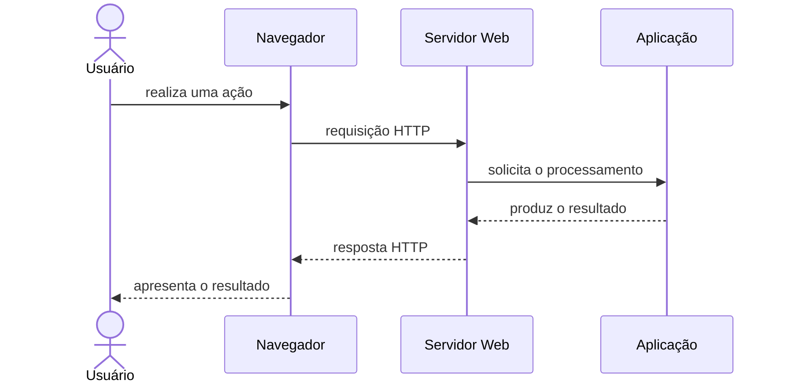

# HTTP: como as aplicações Web se comunicam

Quando acessamos uma página, enviamos um formulário ou consultamos uma API, clientes e servidores precisam trocar informações. O protocolo HTTP define as regras básicas dessa comunicação.

Esta apostila apresenta os conhecimentos de HTTP essenciais para iniciar o desenvolvimento Web. Assuntos mais avançados serão apenas mencionados para que possam ser estudados futuramente.

Depois da leitura, realize a [atividade prática](atividade-pratica.md) para observar requisições e respostas no navegador.

## Índice

1. [HTTP na Web](#http-na-web)
2. [O fluxo de requisição e resposta](#fluxo)
3. [Como o navegador carrega uma página](#carregamento)
4. [Recursos e endereços](#recursos-enderecos)
5. [Estrutura das mensagens HTTP](#mensagens)
6. [Métodos HTTP](#metodos)
7. [Códigos de status](#status)
8. [Cabeçalhos e formatos de conteúdo](#cabecalhos)
9. [HTTP em páginas e APIs](#paginas-apis)
10. [HTTP não guarda estado](#estado)
11. [HTTP e HTTPS](#https)
12. [HTTP e PHP](#php)
13. [Prática com o navegador e o Postman](#pratica)
14. [Assuntos para estudar depois](#aprofundamento)
15. [Quadro de consulta rápida](#consulta-rapida)

<a id="http-na-web"></a>

## 1. HTTP na Web

**HTTP** significa *Hypertext Transfer Protocol*, ou **Protocolo de Transferência de Hipertexto**. Um protocolo é um conjunto de regras que permite a comunicação entre programas.

Na Web, um programa atua como **cliente** e envia uma requisição. Outro atua como **servidor**, processa o pedido e devolve uma resposta.

O navegador é o cliente mais conhecido, mas não é o único. Aplicativos para celular, programas de linha de comando e outros servidores também podem usar HTTP.

O HTTP pode transportar diferentes tipos de conteúdo:

- páginas HTML;
- arquivos CSS e JavaScript;
- imagens, fontes, áudio e vídeo;
- dados em formatos como JSON;
- arquivos para download.

<a id="fluxo"></a>

## 2. O fluxo de requisição e resposta

Toda comunicação HTTP começa com uma requisição do cliente. O servidor não responde antes de receber um pedido.



Em uma aplicação com banco de dados, o back-end pode consultá-lo antes de produzir a resposta.

### Exemplo: consulta de um produto

1. O usuário abre `/produtos/15`.
2. O navegador envia uma requisição `GET`.
3. O servidor identifica o recurso solicitado.
4. A aplicação consulta o produto, se necessário.
5. O servidor responde com um código de status, cabeçalhos e conteúdo.
6. O navegador processa e apresenta o resultado.

Uma nova ação do usuário pode iniciar outra requisição. A comunicação acontece em vários ciclos de requisição e resposta.

<a id="carregamento"></a>

## 3. Como o navegador carrega uma página

Uma página normalmente precisa de várias requisições. Primeiro, o navegador solicita o documento HTML. Ao ler esse documento, encontra referências para outros recursos e também os solicita.

| Ordem aproximada | Recurso solicitado | Papel |
|---:|---|---|
| 1 | Documento HTML | Estrutura e conteúdo da página |
| 2 | Arquivos CSS | Aparência e layout |
| 3 | Arquivos JavaScript | Comportamento e interatividade |
| 4 | Imagens e fontes | Recursos visuais |
| 5 | Dados de uma API | Conteúdo carregado ou atualizado pela aplicação |

Por isso, abrir uma única página pode gerar dezenas de requisições. A aba **Network** das ferramentas do desenvolvedor permite observar cada uma delas.

<a id="recursos-enderecos"></a>

## 4. Recursos e endereços

No HTTP, chamamos de **recurso** aquilo que pode ser identificado e acessado, como uma página, uma imagem ou um produto fornecido por uma API.

Uma **URL** indica o endereço de um recurso. Observe:

```text
http://localhost:8000/produtos?id=15
```

| Parte | Exemplo | Significado |
|---|---|---|
| Esquema | `http` | Protocolo usado no acesso |
| Host | `localhost` | Computador ou domínio procurado |
| Porta | `8000` | Programa que receberá a comunicação naquele host |
| Caminho | `/produtos` | Recurso solicitado |
| Consulta | `?id=15` | Parâmetro enviado no endereço |

Em um endereço público, o **DNS** ajuda a converter o domínio, como `www.exemplo.com`, em um endereço de rede que permite localizar o servidor.

<a id="mensagens"></a>

## 5. Estrutura das mensagens HTTP

Uma mensagem HTTP possui uma linha inicial, cabeçalhos e, em alguns casos, um corpo.

### Exemplo de requisição

```http
GET /produtos/15 HTTP/1.1
Host: loja.exemplo.com
Accept: application/json
```

Nessa requisição:

- `GET` é o método;
- `/produtos/15` é o caminho;
- `HTTP/1.1` indica a versão usada na mensagem;
- `Host` e `Accept` são cabeçalhos.

### Exemplo de resposta

```http
HTTP/1.1 200 OK
Content-Type: application/json

{"id": 15, "nome": "Caderno"}
```

Na resposta:

- `200 OK` informa o resultado;
- `Content-Type` identifica o formato do conteúdo;
- a linha vazia separa os cabeçalhos do corpo;
- o corpo transporta os dados solicitados.

Nem toda mensagem possui corpo. Uma requisição `GET`, por exemplo, normalmente envia os parâmetros na URL. Respostas como `204 No Content` também não possuem conteúdo.

<a id="metodos"></a>

## 6. Métodos HTTP

O método indica a intenção principal da requisição.

| Método | Uso comum | Exemplo |
|---|---|---|
| `GET` | Consultar um recurso | Listar produtos |
| `POST` | Enviar dados ou solicitar um processamento | Cadastrar um produto |
| `PUT` | Substituir a representação de um recurso | Atualizar todos os dados de um produto |
| `PATCH` | Alterar parte de um recurso | Alterar apenas o preço |
| `DELETE` | Solicitar a remoção de um recurso | Excluir um produto |

Os significados indicam a intenção, mas o servidor decide o que será executado e deve verificar dados e permissões.

Links e a navegação comum usam principalmente `GET`. Formulários HTML oferecem diretamente `GET` e `POST`. Aplicações JavaScript e clientes de API conseguem usar os demais métodos.

<a id="status"></a>

## 7. Códigos de status

Toda resposta HTTP possui um código de três algarismos. O primeiro algarismo indica a categoria geral.

| Faixa | Categoria | Ideia principal |
|---:|---|---|
| `1xx` | Informação | O processamento ainda está em andamento |
| `2xx` | Sucesso | A requisição foi atendida |
| `3xx` | Redirecionamento | O cliente deve considerar outro endereço ou uma versão armazenada |
| `4xx` | Erro do cliente | Há um problema com o pedido ou com o acesso |
| `5xx` | Erro do servidor | O servidor falhou ao processar um pedido válido |

Alguns códigos aparecem com frequência:

| Código | Significado básico | Situação comum |
|---:|---|---|
| `200 OK` | Sucesso | Consulta realizada |
| `201 Created` | Recurso criado | Cadastro concluído em uma API |
| `204 No Content` | Sucesso sem corpo na resposta | Exclusão concluída |
| `301` ou `302` | Redirecionamento | Acesso encaminhado para outra URL |
| `400 Bad Request` | Requisição inválida | Dados malformados |
| `401 Unauthorized` | Autenticação necessária ou inválida | Usuário não identificado corretamente |
| `403 Forbidden` | Acesso proibido | Usuário identificado, mas sem permissão |
| `404 Not Found` | Recurso não encontrado | URL ou identificador inexistente |
| `422 Unprocessable Content` | Dados compreendidos, mas inválidos | Erro de validação |
| `500 Internal Server Error` | Erro inesperado no servidor | Falha durante o processamento |
| `503 Service Unavailable` | Serviço indisponível | Manutenção ou sobrecarga temporária |

O código resume o resultado; o corpo da resposta pode trazer uma página de erro ou detalhes adicionais. Não é necessário memorizar todos os códigos: primeiro reconheça as categorias e os mais comuns.

<a id="cabecalhos"></a>

## 8. Cabeçalhos e formatos de conteúdo

Os **cabeçalhos** carregam informações sobre a requisição ou a resposta. Eles não são o conteúdo principal da mensagem.

| Cabeçalho | Finalidade básica |
|---|---|
| `Content-Type` | Informa o formato do corpo enviado |
| `Accept` | Informa quais formatos o cliente prefere receber |
| `Authorization` | Envia uma credencial de acesso conforme o mecanismo adotado |
| `Cookie` e `Set-Cookie` | Transportam pequenos dados usados pelo navegador e pelo servidor |

O `Content-Type` ajuda o cliente a processar corretamente o corpo:

| Conteúdo | Tipo comum |
|---|---|
| HTML | `text/html` |
| CSS | `text/css` |
| JavaScript | `text/javascript` |
| JSON | `application/json` |
| Imagem PNG | `image/png` |

Existem muitos outros cabeçalhos. Neste momento, o mais importante é saber que eles descrevem a comunicação e podem ser inspecionados na aba **Network**.

<a id="paginas-apis"></a>

## 9. HTTP em páginas e APIs

O HTTP é usado tanto por aplicações com interface gráfica quanto por APIs.

| Situação | O cliente solicita | Resposta comum |
|---|---|---|
| Página gerada no servidor | Uma tela ou rota da aplicação | HTML |
| Página com arquivos estáticos | CSS, JavaScript, imagens e fontes | Arquivos nos formatos correspondentes |
| Front-end que consulta uma API | Dados de um recurso | JSON |
| Aplicativo para celular | Dados ou execução de uma ação | Geralmente JSON |
| Integração entre sistemas | Dados ou processamento | JSON ou outro formato combinado |

Uma **API Web** oferece endereços e regras para que outros programas usem dados ou funções de uma aplicação. Ela não precisa possuir uma interface visual própria.

Exemplo de uma API de produtos:

```text
GET    /api/produtos
GET    /api/produtos/15
POST   /api/produtos
PATCH  /api/produtos/15
DELETE /api/produtos/15
```

As páginas e as APIs usam o mesmo modelo de requisição e resposta. O que muda principalmente é o cliente e o formato do conteúdo retornado.

<a id="estado"></a>

## 10. HTTP não guarda estado

Por padrão, cada requisição HTTP é independente. O protocolo não se lembra automaticamente das requisições anteriores de um usuário.

Aplicações precisam reconhecer situações como “este usuário já entrou no sistema” ou “este carrinho possui dois produtos”. Para isso, podem usar:

- **cookies**, pequenos dados mantidos pelo navegador e enviados ao servidor;
- **sessões**, dados associados ao usuário e normalmente mantidos no servidor;
- **tokens**, valores enviados pelo cliente para comprovar uma autenticação ou autorização.

Esses recursos acrescentam estado à aplicação, embora cada troca HTTP continue sendo uma nova requisição e uma nova resposta.

<a id="https"></a>

## 11. HTTP e HTTPS

**HTTPS** é HTTP protegido por TLS. Essa proteção oferece três benefícios centrais:

- dificulta a leitura dos dados durante o transporte;
- ajuda a detectar alterações na comunicação;
- permite verificar a identidade do servidor por meio de certificado.

Ao acessar `https://`, o navegador estabelece a conexão protegida antes de trocar as mensagens HTTP.

HTTPS protege o caminho da comunicação, mas não garante que todas as informações de um site sejam verdadeiras nem corrige falhas da aplicação. Em sistemas publicados, seu uso é essencial. Em práticas locais, é comum iniciar com `http://localhost`.

<a id="php"></a>

## 12. HTTP e PHP

O PHP é executado no servidor. Ele recebe informações da requisição, realiza o processamento e ajuda a construir a resposta HTTP.

```php
<?php

header('Content-Type: application/json');
http_response_code(200);

echo json_encode([
    'mensagem' => 'Resposta produzida pelo PHP'
]);
```

Nesse exemplo, o PHP define um cabeçalho, escolhe o código de status e produz um corpo em JSON.

Em projetos reais, o código também pode validar dados, consultar um banco, verificar permissões e escolher uma página ou resposta adequada. Frameworks como Laravel organizam essas tarefas, mas continuam recebendo requisições e produzindo respostas HTTP.

<a id="pratica"></a>

## 13. Prática com o navegador e o Postman

### No navegador

1. Abra uma página.
2. Pressione `F12` e selecione **Network** ou **Rede**.
3. Atualize a página.
4. Escolha uma requisição e localize:
   - URL;
   - método;
   - código de status;
   - cabeçalhos;
   - corpo da resposta, quando existir.

A [atividade prática deste assunto](atividade-pratica.md) orienta a execução de um servidor PHP local e a observação de respostas `200` e `404`.

### No Postman

O Postman permite montar requisições sem criar uma interface gráfica. Nele é possível escolher o método, informar a URL, configurar cabeçalhos ou corpo e examinar a resposta.

Experimente uma API pública indicada pelo professor ou uma API local criada durante a disciplina. Antes de enviar dados, confirme que o endereço foi preparado para testes.

<a id="aprofundamento"></a>

## 14. Assuntos para estudar depois

O HTTP possui recursos que não precisam ser dominados no primeiro contato:

- versões HTTP/1.1, HTTP/2 e HTTP/3;
- cache e validação de conteúdo;
- compactação das respostas;
- autenticação e controle de acesso;
- CORS e políticas do navegador;
- negociação de conteúdo;
- proxies, gateways e redes de distribuição de conteúdo;
- transmissão contínua e comunicação em tempo real.

Esses temas explicam desempenho, segurança e integração em aplicações maiores. A base continua sendo o fluxo de requisição e resposta apresentado nesta apostila.

<a id="consulta-rapida"></a>

## 15. Quadro de consulta rápida

| Conceito | Ideia principal |
|---|---|
| HTTP | Protocolo de comunicação usado na Web |
| Cliente | Programa que inicia a requisição |
| Servidor | Programa que recebe o pedido e envia a resposta |
| Recurso | Página, dado ou arquivo identificado por uma URL |
| Método | Intenção da requisição, como consultar ou cadastrar |
| Status | Resultado resumido da requisição |
| Cabeçalho | Informação adicional sobre a mensagem |
| Corpo | Conteúdo transportado pela mensagem |
| `GET` | Consulta um recurso |
| `POST` | Envia dados ou solicita processamento |
| `200` | Sucesso |
| `404` | Recurso não encontrado |
| `500` | Erro no servidor |
| HTML | Formato comum de resposta para páginas |
| JSON | Formato comum de resposta para APIs |
| HTTPS | HTTP protegido por TLS |

## O que você precisa guardar

- O HTTP organiza a comunicação entre clientes e servidores.
- O cliente envia uma requisição e o servidor devolve uma resposta.
- Uma página pode gerar várias requisições para HTML, CSS, JavaScript, imagens e dados.
- A URL identifica o recurso; o método indica a intenção da requisição.
- A resposta possui um código de status e pode incluir cabeçalhos e corpo.
- `GET` e `POST` são comuns em páginas e formulários; APIs também usam `PUT`, `PATCH` e `DELETE`.
- Códigos `2xx` indicam sucesso, `4xx` problemas no pedido ou acesso e `5xx` falhas no servidor.
- Páginas costumam receber HTML; APIs costumam trocar JSON.
- O HTTP não guarda estado automaticamente; aplicações usam cookies, sessões ou tokens quando precisam reconhecer o usuário.
- HTTPS protege a comunicação, e ferramentas como Network e Postman permitem observá-la.

## Referências para estudo

- [Visão geral do HTTP — MDN Web Docs](https://developer.mozilla.org/pt-BR/docs/Web/HTTP/Guides/Overview)
- [Métodos de requisição HTTP — MDN Web Docs](https://developer.mozilla.org/pt-BR/docs/Web/HTTP/Reference/Methods)
- [Códigos de status HTTP — MDN Web Docs](https://developer.mozilla.org/pt-BR/docs/Web/HTTP/Reference/Status)
- [Painel Network — Chrome for Developers](https://developer.chrome.com/docs/devtools/network/)
- [Primeiros passos com o Postman — documentação oficial](https://learning.postman.com/docs/getting-started/first-steps/sending-the-first-request/)
- [Semântica do HTTP — RFC 9110](https://www.rfc-editor.org/rfc/rfc9110.html)
