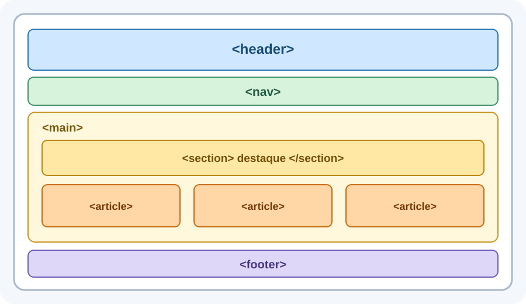
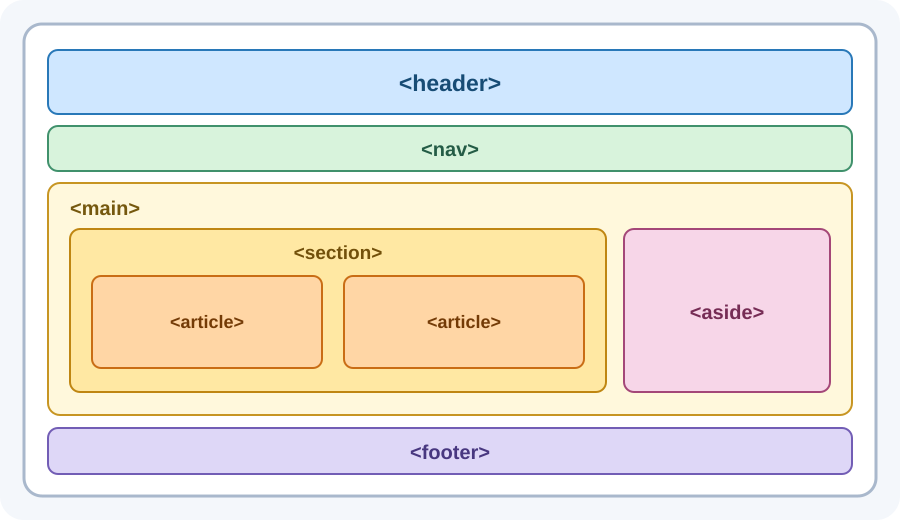
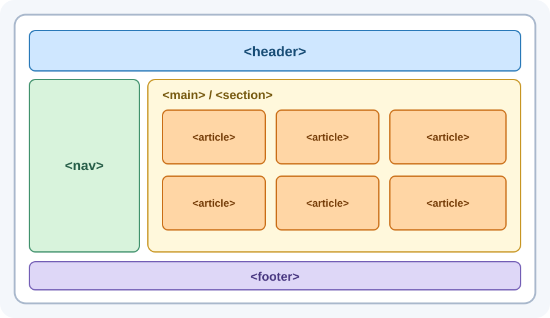
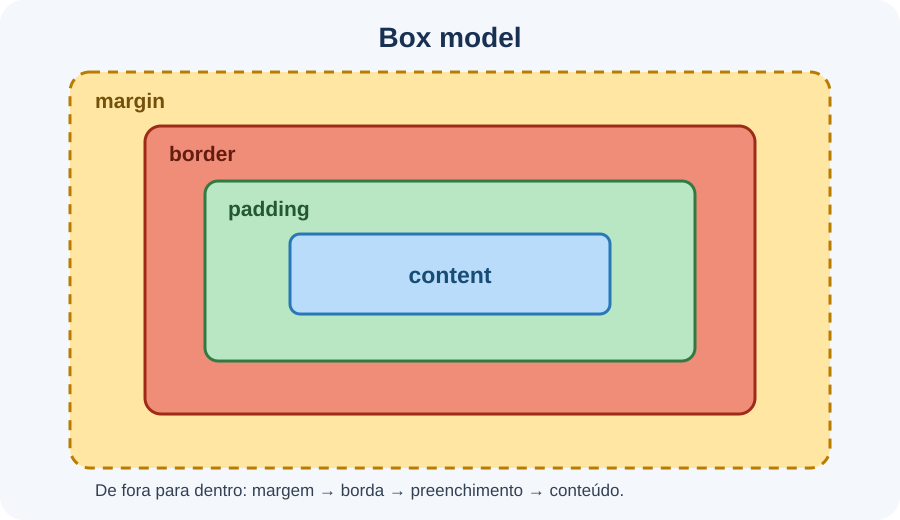

# HTML e CSS: estrutura, estilo e layout

> Esta apostila apresenta os fundamentos e os exemplos intermediários. O site final da clínica veterinária está planejado na [Seção 16](#16-projeto-final-site-da-clínica-veterinária), mas seu código será criado em outra iteração.

Uma página Web pode ser comparada a uma construção:

- o **HTML** define os ambientes e a função de cada parte;
- o **CSS** define cores, dimensões, espaçamentos e a organização visual;
- o **JavaScript** permite que a página reaja a ações e altere seu comportamento.

Essa comparação ajuda no início, mas cada tecnologia pode participar de tarefas mais amplas. O ponto principal é que elas possuem responsabilidades diferentes e trabalham em conjunto.

## Índice

1. [As três tecnologias do front-end](#1-as-três-tecnologias-do-front-end)
2. [O que é HTML?](#2-o-que-é-html)
3. [Estrutura básica de um documento HTML](#3-estrutura-básica-de-um-documento-html)
4. [Elementos, tags, conteúdo e atributos](#4-elementos-tags-conteúdo-e-atributos)
5. [O `head` e suas tags mais usadas](#5-o-head-e-suas-tags-mais-usadas)
6. [O `body` e seus elementos mais usados](#6-o-body-e-seus-elementos-mais-usados)
7. [HTML semântico](#7-html-semântico)
8. [Layouts populares com tags semânticas](#8-layouts-populares-com-tags-semânticas)
9. [O que é CSS?](#9-o-que-é-css)
10. [Onde escrever o CSS](#10-onde-escrever-o-css)
11. [Regras, seletores, propriedades e valores](#11-regras-seletores-propriedades-e-valores)
12. [Cascata, especificidade e conflitos](#12-cascata-especificidade-e-conflitos)
13. [Propriedades frequentes](#13-propriedades-frequentes)
14. [Box model](#14-box-model)
15. [Posicionamento e Grid](#15-posicionamento-e-grid)
16. [Projeto final: site da clínica veterinária](#16-projeto-final-site-da-clínica-veterinária)
17. [Extras: transições e animações](#17-extras-transições-e-animações)
18. [O que você precisa guardar](#18-o-que-você-precisa-guardar)

## 1. As três tecnologias do front-end

O **front-end** é a parte da aplicação com a qual a pessoa interage. Em uma página executada no navegador, HTML, CSS e JavaScript normalmente colaboram da seguinte forma:

| Tecnologia | Papel principal | Exemplo |
|---|---|---|
| HTML | Estrutura e significado do conteúdo | Identificar um título, um menu, uma imagem ou uma tabela |
| CSS | Aparência e organização visual | Definir cores, fontes, espaçamentos, bordas e colunas |
| JavaScript | Comportamento e interatividade | Abrir um menu, validar uma ação ou atualizar dados sem recarregar a página |

Considere um botão de agendamento:

- o HTML informa que aquele elemento é um botão e define seu texto;
- o CSS determina sua cor, seu tamanho e sua posição;
- o JavaScript pode executar uma ação quando ele for selecionado.

Separar essas responsabilidades deixa o projeto mais previsível e facilita sua manutenção.

## 2. O que é HTML?

**HTML** significa *HyperText Markup Language*, ou Linguagem de Marcação de Hipertexto.

HTML não é uma linguagem de programação. Ele utiliza marcações para descrever a estrutura e o significado do conteúdo. O navegador interpreta essas marcações e constrói uma árvore de elementos que será apresentada na tela e poderá ser utilizada pelo CSS, pelo JavaScript e por tecnologias assistivas.

Um arquivo HTML normalmente utiliza a extensão `.html`:

```text
index.html
servicos.html
contato.html
```

## 3. Estrutura básica de um documento HTML

Todo documento pode começar com esta estrutura:

```html
<!DOCTYPE html>
<html lang="pt-BR">
<head>
  <title>Clínica Veterinária</title>
  <link rel="stylesheet" href="styles.css">
</head>
<body>
  <h1>Clínica Veterinária</h1>
  <p>Cuidado e bem-estar para o seu animal.</p>
</body>
</html>
```

### O papel de cada parte

| Trecho | Função |
|---|---|
| `<!DOCTYPE html>` | Informa ao navegador que o documento usa o HTML atual |
| `<html lang="pt-BR">` | Elemento raiz; `lang` informa o idioma principal |
| `<head>` | Reúne metadados e recursos usados pelo documento |
| `<body>` | Contém o que forma a página e será apresentado ou usado na interface |

O `head` e o `body` são filhos de `html`. Eles não são alternativas: cada um possui uma responsabilidade.

## 4. Elementos, tags, conteúdo e atributos

Observe este link:

```html
<a href="servicos.html">Conheça os serviços</a>
```

Ele possui:

- **tag de abertura:** `<a href="servicos.html">`;
- **nome do elemento:** `a`;
- **atributo:** `href`;
- **valor do atributo:** `servicos.html`;
- **conteúdo:** `Conheça os serviços`;
- **tag de fechamento:** `</a>`.

O conjunto representa um **elemento HTML**.

### Elementos aninhados

Elementos podem ficar dentro de outros elementos. Esse aninhamento cria uma hierarquia:

```html
<article>
  <h2>Consulta preventiva</h2>
  <p>A consulta inclui avaliação geral e orientações.</p>
</article>
```

Nesse exemplo:

- `article` é o elemento pai;
- `h2` e `p` são filhos de `article`;
- os elementos irmãos `h2` e `p` estão no mesmo nível.

Feche os elementos na ordem inversa em que foram abertos:

```html
<!-- Correto -->
<p>Texto com <strong>uma informação importante</strong>.</p>

<!-- Incorreto -->
<p>Texto com <strong>uma informação importante.</p></strong>
```

### Elementos sem tag de fechamento

Alguns elementos não envolvem conteúdo e não possuem tag de fechamento. Eles são chamados de **elementos vazios**:

```html

<input type="text" name="responsavel">
```

### Atributos

Atributos acrescentam informações ou configuram o elemento:

```html
<a href="contato.html" title="Abrir a página de contato">Contato</a>

```

Nem todo atributo serve para todo elemento. Consulte a documentação quando tiver dúvida.

## 5. O `head` e suas tags mais usadas

O `head` contém informações **sobre o documento** e referências a recursos necessários. Seu conteúdo normalmente não forma a região principal visível da página.

```html
<head>
  <meta name="description" content="Clínica veterinária com consultas, vacinas e exames.">

  <title>Clínica Veterinária</title>

  <link rel="icon" href="imagens/icone.png">
  <link rel="stylesheet" href="css/styles.css">

  <script src="js/script.js" defer></script>
</head>
```

| Elemento | Uso |
|---|---|
| `meta name="description"` | Oferece um resumo que mecanismos de busca podem usar |
| `title` | Define o título exibido na aba e usado como nome do documento |
| `link rel="stylesheet"` | Conecta um arquivo CSS externo |
| `link rel="icon"` | Define o ícone associado à página |
| `script` | Carrega JavaScript; `defer` aguarda a análise do HTML antes da execução |

Use títulos claros e específicos:

```html
<!-- Pouco informativo -->
<title>Página</title>

<!-- Mais informativo -->
<title>Serviços | Clínica Veterinária Amigo Animal</title>
```

## 6. O `body` e seus elementos mais usados

O `body` reúne o conteúdo e os controles que compõem a interface.

| Grupo | Elementos frequentes |
|---|---|
| Títulos e texto | `h1` a `h6`, `p`, `strong`, `em` |
| Navegação e mídia | `a`, `img`, `figure`, `figcaption` |
| Listas | `ul`, `ol`, `li` |
| Agrupamento genérico | `div`, `span` |
| Dados tabulares | `table`, `caption`, `thead`, `tbody`, `tr`, `th`, `td` |
| Formulários | `form`, `label`, `input`, `select`, `textarea`, `button` |

### Títulos e parágrafos

HTML oferece seis níveis de título:

```html
<h1>Clínica Amigo Animal</h1>
<h2>Serviços</h2>
<h3>Consultas</h3>
<p>Realizamos consultas preventivas e atendimentos clínicos.</p>
```

`h1` representa o título principal. `h2` inicia uma subseção do conteúdo principal; `h3` cria uma subseção dentro dela, e assim por diante. Escolha o nível pela hierarquia, e não pelo tamanho visual — o tamanho deve ser alterado com CSS.

Para dar significado a trechos de texto:

```html
<p>O atendimento de emergência funciona <strong>24 horas</strong>.</p>
<p>Traga a carteirinha, <em>quando estiver disponível</em>.</p>
```

### Links

```html
<a href="servicos.html">Ver serviços</a>
<a href="https://example.com">Abrir outro site</a>
<a href="mailto:contato@example.com">Enviar e-mail</a>
<a href="#vacinas">Ir para a seção de vacinas</a>
```

O atributo `href` indica o destino. O texto do link deve explicar para onde ele leva; “ver serviços” comunica mais do que “clique aqui”.

### Imagens e figuras

```html
<figure>
  
  <figcaption>Consulta preventiva na unidade central.</figcaption>
</figure>
```

O texto alternativo do atributo `alt` comunica a finalidade da imagem quando ela não pode ser vista. Se a imagem for apenas decorativa, use `alt=""` para que ela não gere ruído para leitores de tela.

### Listas

Use `ul` quando a ordem não for importante:

```html
<ul>
  <li>Consultas</li>
  <li>Vacinação</li>
  <li>Exames laboratoriais</li>
</ul>
```

Use `ol` quando a sequência fizer diferença:

```html
<ol>
  <li>Solicite o agendamento.</li>
  <li>Confirme os dados do animal.</li>
  <li>Compareça no horário marcado.</li>
</ol>
```

### `div` e `span`

`div` agrupa elementos em bloco. `span` envolve um pequeno trecho de conteúdo:

```html
<div class="cartao">
  <h2>Vacinação</h2>
  <p>Atendimento de segunda a sábado.</p>
</div>

<p>Preço promocional: <span class="preco">R$ 80,00</span>.</p>
```

Esses elementos não descrevem, sozinhos, o significado do conteúdo. São úteis como agrupadores quando não existe um elemento semântico mais adequado.

### Tabelas

Tabelas representam dados relacionados em linhas e colunas:

```html
<table>
  <caption>Serviços e preços</caption>
  <thead>
    <tr>
      <th scope="col">Serviço</th>
      <th scope="col">Duração</th>
      <th scope="col">Preço</th>
    </tr>
  </thead>
  <tbody>
    <tr>
      <td>Consulta</td>
      <td>40 minutos</td>
      <td>R$ 120,00</td>
    </tr>
    <tr>
      <td>Vacinação</td>
      <td>20 minutos</td>
      <td>R$ 80,00</td>
    </tr>
  </tbody>
</table>
```

| Elemento | Significado |
|---|---|
| `table` | Tabela completa |
| `caption` | Título ou descrição da tabela |
| `thead` | Grupo de cabeçalhos |
| `tbody` | Corpo dos dados |
| `tr` | Linha |
| `th` | Célula de cabeçalho |
| `td` | Célula de dado |

Não use tabelas para montar o layout da página. Para layout, utilize recursos do CSS, como Grid.

### Formulários

Um formulário reúne campos e outros controles para receber dados. O elemento `form` delimita o formulário:

```html
<form action="salvar-agendamento.php" method="post">
  <fieldset>
    <legend>Dados do responsável</legend>

    <label for="responsavel">Nome</label>
    <input
      id="responsavel"
      name="responsavel"
      type="text"
      required
      maxlength="100"
    >

    <label for="email">E-mail</label>
    <input id="email" name="email" type="email" required>

    <label for="telefone">Telefone</label>
    <input
      id="telefone"
      name="telefone"
      type="tel"
      placeholder="(81) 99999-9999"
    >
  </fieldset>

  <fieldset>
    <legend>Dados do animal</legend>

    <label for="animal">Nome do animal</label>
    <input id="animal" name="animal" type="text" required>

    <label for="especie">Espécie</label>
    <select id="especie" name="especie" required>
      <option value="">Selecione uma opção</option>
      <option value="cao">Cão</option>
      <option value="gato">Gato</option>
      <option value="ave">Ave</option>
      <option value="outro">Outro</option>
    </select>

    <label for="data">Data desejada</label>
    <input id="data" name="data" type="date" required>

    <label for="idade">Idade aproximada</label>
    <input id="idade" name="idade" type="number" min="0" max="40">
  </fieldset>

  <fieldset>
    <legend>Preferências</legend>

    <p>Período preferido</p>

    <input id="manha" name="periodo" type="radio" value="manha">
    <label for="manha">Manhã</label>

    <input id="tarde" name="periodo" type="radio" value="tarde">
    <label for="tarde">Tarde</label>

    <input id="lembrete" name="lembrete" type="checkbox" value="sim">
    <label for="lembrete">Desejo receber um lembrete</label>
  </fieldset>

  <label for="observacoes">Observações</label>
  <textarea id="observacoes" name="observacoes" rows="5"></textarea>

  <button type="submit">Solicitar agendamento</button>
</form>
```

#### Partes do formulário

| Parte | Função |
|---|---|
| `form` | Agrupa os campos e define como os dados serão enviados |
| `action` | Indica o endereço que receberá os dados |
| `method` | Define o método HTTP usado no envio, normalmente `get` ou `post` |
| `label` | Apresenta o nome ou a orientação de um campo |
| `input` | Cria campos que variam de acordo com o atributo `type` |
| `select` | Cria uma lista de opções |
| `textarea` | Cria uma área para texto com várias linhas |
| `fieldset` | Agrupa controles relacionados |
| `legend` | Apresenta o título de um `fieldset` |
| `button` | Cria um botão para enviar ou controlar o formulário |

O atributo `for` do `label` deve possuir o mesmo valor que o `id` do campo:

```html
<label for="email">E-mail</label>
<input id="email" name="email" type="email">
```

Essa associação permite selecionar o campo ao clicar no texto e ajuda leitores de tela a identificarem sua finalidade.

#### `id`, `name` e `value`

Esses atributos possuem funções diferentes:

- `id` identifica o elemento dentro da página e permite associá-lo a um `label`;
- `name` define o nome usado no envio do dado;
- `value` representa o valor que será enviado.

Por exemplo:

```html
<input id="tarde" name="periodo" type="radio" value="tarde">
<label for="tarde">Tarde</label>
```

Se essa opção for marcada, o formulário enviará o par `periodo=tarde`. Um campo sem `name` normalmente não terá seu valor enviado.

#### Métodos `get` e `post`

| Método | Uso introdutório |
|---|---|
| `get` | Consultas e filtros; os valores aparecem no endereço da página |
| `post` | Envio de dados que serão processados, como cadastros e agendamentos |

O uso de `post` não torna os dados automaticamente seguros. Informações sensíveis exigem conexão HTTPS, validação no servidor e outros cuidados no back-end.

#### Tipos frequentes de `input`

O atributo `type` modifica o comportamento do campo:

| Tipo | Uso típico |
|---|---|
| `text` | Texto curto, como nome ou cidade |
| `email` | Endereço de e-mail com validação básica do formato |
| `password` | Oculta visualmente os caracteres; não criptografa os dados |
| `tel` | Número de telefone |
| `number` | Valor numérico; pode usar `min`, `max` e `step` |
| `date` | Escolha de uma data |
| `radio` | Escolha de apenas uma opção de um grupo |
| `checkbox` | Opção que pode ser marcada ou desmarcada |
| `file` | Seleção de um arquivo |
| `color` | Escolha de uma cor |
| `range` | Escolha de um valor em uma faixa |

Botões de rádio pertencem ao mesmo grupo quando compartilham o mesmo `name`:

```html
<input id="cao" name="especie" type="radio" value="cao">
<label for="cao">Cão</label>

<input id="gato" name="especie" type="radio" value="gato">
<label for="gato">Gato</label>
```

Nesse caso, apenas uma espécie poderá ser selecionada. Caixas de seleção são apropriadas quando as escolhas são independentes ou quando várias opções podem ser marcadas. O valor de um `checkbox` normalmente só é enviado quando ele está marcado.

Para enviar arquivos, o formulário precisa usar `method="post"` e `enctype="multipart/form-data"`:

```html
<form action="enviar-arquivo.php" method="post" enctype="multipart/form-data">
  <label for="documento">Documento</label>
  <input id="documento" name="documento" type="file">
  <button type="submit">Enviar</button>
</form>
```

#### Atributos úteis para os campos

| Atributo | Função |
|---|---|
| `required` | Torna o preenchimento obrigatório |
| `placeholder` | Mostra uma dica temporária dentro do campo |
| `min` e `max` | Definem limites para números ou datas |
| `minlength` e `maxlength` | Definem quantidades mínima e máxima de caracteres |
| `checked` | Deixa um `radio` ou `checkbox` inicialmente marcado |
| `readonly` | Permite visualizar, mas não alterar o valor |
| `disabled` | Desabilita o controle e impede seu envio |

O `placeholder` é apenas uma dica e não substitui o `label`, pois desaparece quando a pessoa começa a digitar.

#### O elemento `select`

`select` apresenta opções definidas por elementos `option`:

```html
<label for="unidade">Unidade de atendimento</label>
<select id="unidade" name="unidade" required>
  <option value="">Selecione uma unidade</option>
  <option value="centro">Unidade Centro</option>
  <option value="jardins">Unidade Jardins</option>
  <option value="norte">Unidade Norte</option>
</select>
```

O texto entre as tags `option` é mostrado à pessoa. O atributo `value` define o dado enviado ao servidor. Se a opção “Unidade Jardins” for escolhida, será enviado `unidade=jardins`.

#### Validação

Atributos como `required`, `type="email"`, `min` e `max` permitem que o navegador faça verificações básicas antes do envio. Essa validação melhora a experiência, mas não substitui a validação no servidor, pois os dados ainda podem ser enviados por outros meios ou alterados.

## 7. HTML semântico

Um elemento é **semântico** quando seu nome comunica a função do conteúdo. Compare:

```html
<!-- O nome da classe tenta explicar uma div genérica -->
<div class="menu-principal">...</div>

<!-- O próprio elemento comunica sua função -->
<nav aria-label="Navegação principal">...</nav>
```

### Por que usar semântica?

| Benefício | Como ajuda |
|---|---|
| Leitura do código | A finalidade de cada região fica mais evidente |
| Manutenção | É mais fácil localizar menus, conteúdos e rodapés |
| Trabalho em equipe | Os nomes criam um vocabulário compartilhado |
| Acessibilidade | Leitores de tela podem usar títulos e regiões como pontos de navegação |
| Busca | Mecanismos conseguem interpretar melhor a estrutura e o propósito do conteúdo |

Semântica não torna uma página automaticamente acessível nem garante melhor posição em buscadores. Conteúdo claro, hierarquia correta, textos alternativos, contraste, operação por teclado e outros cuidados continuam necessários.

### Elementos semânticos de layout

| Elemento | Uso típico |
|---|---|
| `header` | Cabeçalho da página ou de uma seção |
| `nav` | Grupo importante de links de navegação |
| `main` | Conteúdo principal e único daquela página |
| `section` | Seção temática, normalmente identificada por um título |
| `article` | Conteúdo independente ou reutilizável, como notícia, produto ou cartão |
| `aside` | Conteúdo complementar ao conteúdo ao redor |
| `footer` | Rodapé da página ou de uma seção |

Exemplo:

```html
<body>
  <header>
    <h1>Clínica Amigo Animal</h1>
  </header>

  <nav aria-label="Navegação principal">
    <a href="index.html">Início</a>
    <a href="servicos.html">Serviços</a>
    <a href="contato.html">Contato</a>
  </nav>

  <main>
    <section>
      <h2>Serviços em destaque</h2>

      <article>
        <h3>Consulta preventiva</h3>
        <p>Acompanhamento periódico da saúde do animal.</p>
      </article>
    </section>

    <aside>
      <h2>Plantão</h2>
      <p>Atendimento de emergência durante 24 horas.</p>
    </aside>
  </main>

  <footer>
    <p>Clínica Amigo Animal</p>
  </footer>
</body>
```

Não substitua toda `div` por `section`. Use `section` quando houver uma seção temática; use `div` quando o agrupamento tiver finalidade apenas técnica ou visual.

## 8. Layouts populares com tags semânticas

As tags não determinam posição, cor ou tamanho. O HTML informa o papel das regiões; o CSS decide como elas serão organizadas visualmente.

### Layout institucional

Uma página institucional costuma usar cabeçalho, menu, destaque e cartões de serviços:



### Layout editorial

Blogs, portais e páginas de notícias frequentemente combinam artigos com conteúdo complementar:



### Dashboard

Painéis administrativos costumam combinar navegação lateral e cartões de indicadores:



Os mesmos elementos semânticos podem assumir layouts diferentes. Evite escolher uma tag apenas por sua aparência padrão.

## 9. O que é CSS?

**CSS** significa *Cascading Style Sheets*, ou Folhas de Estilo em Cascata.

CSS descreve como os elementos serão apresentados. Ele pode controlar:

- cores e fundos;
- fontes e alinhamento;
- larguras e alturas;
- margens e preenchimentos;
- bordas e sombras;
- distribuição em linhas e colunas;
- adaptações para diferentes tamanhos de tela;
- transições e animações.

Enquanto o HTML responde “o que é este conteúdo?”, o CSS responde “como ele deve ser apresentado?”. JavaScript pode alterar classes, atributos ou estilos em resposta a uma interação, mas o CSS continua responsável pelas regras visuais.

## 10. Onde escrever o CSS

Existem três formas comuns.

### Estilo inline

```html
<p style="color: red;">Atendimento encerrado.</p>
```

O estilo fica no próprio elemento. Isso pode ser útil em situações muito específicas ou em testes rápidos, mas mistura estrutura e apresentação, repete código e dificulta alterações gerais.

### Tag `style`

```html
<head>
  <style>
    p {
      color: #374151;
    }
  </style>
</head>
```

As regras ficam no HTML e valem apenas para aquele documento. Pode ser apropriado em uma demonstração isolada, mas não facilita o compartilhamento entre várias páginas.

### Arquivo externo

No HTML:

```html
<link rel="stylesheet" href="css/styles.css">
```

No arquivo `css/styles.css`:

```css
p {
  color: #374151;
}
```

O arquivo externo deve ser a escolha padrão dos nossos exemplos porque:

- mantém HTML e CSS organizados por responsabilidade;
- permite reutilizar as regras em várias páginas;
- reduz repetição;
- centraliza alterações;
- facilita localizar e revisar estilos;
- permite que o navegador reaproveite o arquivo armazenado em cache.

## 11. Regras, seletores, propriedades e valores

Uma regra CSS possui um seletor e um bloco de declarações:

```css
.cartao {
  color: #1f2937;
  background-color: #ffffff;
  border: 1px solid #cbd5e1;
}
```

| Parte | Exemplo | Função |
|---|---|---|
| Seletor | `.cartao` | Escolhe quais elementos receberão as declarações |
| Propriedade | `color` | Indica a característica que será alterada |
| Valor | `#1f2937` | Define a configuração da propriedade |
| Declaração | `color: #1f2937;` | Combina propriedade e valor |
| Regra | Todo o bloco | Reúne o seletor e suas declarações |

### Seletores básicos

Considere:

```html
<article id="consulta-principal" class="cartao destaque">
  <h2>Consulta preventiva</h2>
  <a href="contato.html">Agendar</a>
</article>
```

| Seletor | O que seleciona |
|---|---|
| `article` | Todos os elementos `article` |
| `.cartao` | Elementos cuja lista de classes contém `cartao` |
| `#consulta-principal` | O elemento com esse `id` único |
| `.cartao h2` | Elementos `h2` descendentes de `.cartao` |
| `.cartao > h2` | Elementos `h2` filhos diretos de `.cartao` |
| `[href]` | Elementos que possuem o atributo `href` |
| `a:hover` | Links enquanto recebem o ponteiro |
| `a:focus-visible` | Links destacados pela navegação por teclado |

Exemplos:

```css
article {
  padding: 16px;
}

.destaque {
  background-color: #e0f2fe;
}

#consulta-principal {
  border: 2px solid #0284c7;
}

.cartao h2 {
  color: #075985;
}
```

Prefira classes para estilos reutilizáveis. Um `id` deve identificar um único elemento no documento e normalmente não precisa ser usado para toda estilização.

## 12. Cascata, especificidade e conflitos

“Cascata” é o processo usado pelo navegador para decidir qual declaração será aplicada quando várias regras tentam definir a mesma propriedade no mesmo elemento.

Se duas regras alteram propriedades diferentes, não há conflito: as declarações se combinam.

```css
p {
  color: #334155;
}

p {
  line-height: 1.6;
}
```

O parágrafo recebe as duas propriedades.

### Ordem simplificada de prioridade

Considerando estilos criados pelo autor, na mesma camada e sem `!important`, uma forma introdutória de pensar é:

1. estilo inline;
2. seletor com ID;
3. seletor com classe, atributo ou pseudoclasse;
4. seletor de tipo ou pseudoelemento;
5. quando a especificidade empata, vence a declaração que aparece depois.

Exemplo:

```html
<p id="urgente" class="aviso">Leve a carteirinha de vacinação.</p>
```

```css
p {
  color: green;
}

.aviso {
  color: orange;
}

#urgente {
  color: red;
}
```

O texto fica vermelho. O ID torna o último seletor mais específico. Sua posição no arquivo nem precisaria ser a última para vencer as duas regras normais menos específicas.

### Conflito resolvido pela ordem

```css
.aviso {
  background-color: #fee2e2;
}

.aviso {
  background-color: #fef3c7;
}
```

Os seletores possuem a mesma especificidade. O fundo fica amarelo porque a segunda declaração aparece depois.

### Seletores combinados

```css
.menu a {
  color: #0f766e;
}

a {
  color: #2563eb;
}
```

Mesmo aparecendo antes, `.menu a` é mais específico que `a`.

### `!important`

`!important` força uma declaração a vencer declarações normais da mesma origem:

```css
.aviso {
  color: red !important;
}
```

Ele pode parecer uma solução rápida, mas costuma criar uma disputa de prioridades e dificultar a manutenção. Antes de usá-lo:

1. confira se o seletor está correto;
2. observe a especificidade;
3. verifique a ordem de carregamento;
4. reorganize as regras quando necessário.

Use `!important` apenas quando houver uma justificativa clara e documentada.

Experimente os conflitos em [`exemplos/01-prioridades-css`](exemplos/01-prioridades-css/).

## 13. Propriedades frequentes

### Texto

| Propriedade | Exemplo | Finalidade |
|---|---|---|
| `color` | `color: #1f2937;` | Cor do texto |
| `font-family` | `font-family: Arial, sans-serif;` | Família tipográfica |
| `font-size` | `font-size: 1.25rem;` | Tamanho do texto |
| `font-weight` | `font-weight: 700;` | Peso ou espessura |
| `line-height` | `line-height: 1.6;` | Altura da linha |
| `text-align` | `text-align: center;` | Alinhamento |
| `text-decoration` | `text-decoration: none;` | Decoração, como sublinhado |

### Cores e fundos

```css
.cabecalho {
  color: white;
  background-color: #0f766e;
  background-image: linear-gradient(135deg, #115e59, #14b8a6);
}
```

Cores podem ser representadas por palavras-chave, valores hexadecimais, `rgb()`, `hsl()` e outras notações. Em projetos reais, mantenha uma paleta consistente e garanta contraste suficiente entre texto e fundo.

### Dimensões e espaços

```css
.imagem {
  width: 100%;
  max-width: 640px;
  min-height: 240px;
}

.cartao {
  margin: 20px;
  padding: 24px;
}
```

Valores frequentes:

- `px`: unidade fixa em pixels CSS;
- `%`: proporção em relação a uma referência;
- `rem`: proporção em relação ao tamanho-base de texto;
- `vw` e `vh`: proporções da largura e altura da janela;
- `fr`: fração do espaço disponível em um Grid.

### Bordas, cantos e sombras

```css
.cartao {
  border-width: 2px;
  border-style: solid;
  border-color: #94a3b8;
  border-radius: 12px;
  box-shadow: 0 8px 24px rgb(15 23 42 / 12%);
}
```

A forma abreviada combina espessura, estilo e cor:

```css
.cartao {
  border: 2px solid #94a3b8;
}
```

### Imagens

```css
img {
  display: block;
  max-width: 100%;
  height: auto;
}

.foto-cortada {
  width: 320px;
  height: 200px;
  object-fit: cover;
  border-radius: 12px;
}
```

### Botões e estados de interação

```css
.botao {
  padding: 10px 16px;
  border: 2px solid #0f766e;
  color: white;
  background-color: #0f766e;
}

.botao:hover,
.botao:focus-visible {
  color: #0f766e;
  background-color: white;
}
```

Não dependa apenas de `:hover`, pois pessoas que usam teclado também precisam perceber o foco.

Veja todas essas propriedades aplicadas em [`exemplos/02-propriedades-css`](exemplos/02-propriedades-css/).

## 14. Box model

O navegador representa cada elemento visual como uma caixa. O **box model** descreve quatro camadas:



| Camada | Função |
|---|---|
| Conteúdo | Texto, imagem ou conteúdo interno |
| Padding | Espaço entre o conteúdo e a borda |
| Border | Contorno da caixa |
| Margin | Espaço externo que afasta a caixa das demais |

```css
.caixa {
  width: 200px;
  padding: 20px;
  border: 2px solid #2563eb;
  margin: 10px;
}
```

### `content-box`

Por padrão, `width: 200px` define apenas a largura do conteúdo:

```text
conteúdo:              200 px
padding esquerdo:       20 px
padding direito:        20 px
borda esquerda:          2 px
borda direita:           2 px
largura visível total: 244 px
```

As margens não fazem parte da caixa visível, mas aumentam o espaço ocupado no layout. Com 10 px em cada lado, a área horizontal reservada chega a 264 px.

### `border-box`

Com `border-box`, a largura declarada já inclui conteúdo, padding e borda:

```css
.caixa {
  box-sizing: border-box;
  width: 200px;
  padding: 20px;
  border: 2px solid #2563eb;
}
```

A caixa visível permanece com 200 px. O navegador reduz a área do conteúdo para acomodar o padding e a borda.

É comum aplicar:

```css
* {
  box-sizing: border-box;
}
```

Isso torna cálculos de layout mais previsíveis.

### Laboratório interativo

Abra [`exemplos/03-box-model-dinamico`](exemplos/03-box-model-dinamico/) e altere:

- conteúdo;
- cor de fundo e do texto;
- largura e altura;
- margem e padding;
- cor, estilo e espessura da borda;
- `content-box` e `border-box`.

A página mostra as dimensões da caixa e o espaço ocupado com as margens. Modifique uma propriedade por vez e descreva o que mudou antes de seguir para a próxima.

## 15. Posicionamento e Grid

### Comece pelo fluxo normal

Antes de usar `position`, observe o **fluxo normal**: elementos em bloco costumam ocupar uma linha e aparecem na ordem do HTML. Muitos layouts podem ser construídos com Grid sem retirar elementos desse fluxo.

### A propriedade `position`

| Valor | Comportamento | Uso típico |
|---|---|---|
| `static` | Valor padrão; segue o fluxo normal | Conteúdo comum |
| `relative` | Permanece no fluxo e pode ser deslocado a partir da posição original | Pequenos ajustes e referência para filhos absolutos |
| `absolute` | Sai do fluxo e se posiciona em relação ao ancestral posicionado mais próximo | Selos e elementos sobrepostos dentro de um componente |
| `fixed` | Sai do fluxo e permanece preso à janela | Botão de retorno ao topo |
| `sticky` | Age normalmente até alcançar um limite de rolagem e então fica preso | Título ou menu persistente |

As propriedades `top`, `right`, `bottom` e `left` informam os deslocamentos.

```css
.cartao {
  position: relative;
}

.selo {
  position: absolute;
  top: -10px;
  right: -10px;
}
```

Nesse exemplo, `.cartao` cria a referência de posicionamento para `.selo`. Sem um ancestral posicionado, o elemento absoluto pode usar outra referência e aparecer em um local inesperado.

Quando elementos se sobrepõem, `z-index` ajuda a controlar qual deles fica à frente. Use posicionamento fora do fluxo apenas quando a sobreposição ou a fixação fizer parte do objetivo.

Compare os cinco comportamentos em [`exemplos/04-posicionamento`](exemplos/04-posicionamento/).

### Grid em sua forma mais simples

CSS Grid organiza os filhos de um contêiner em linhas e colunas.

```html
<section class="grade">
  <article>Consulta</article>
  <article>Vacinação</article>
  <article>Exames</article>
</section>
```

```css
.grade {
  display: grid;
  grid-template-columns: repeat(3, 1fr);
  gap: 16px;
}
```

| Declaração | Efeito |
|---|---|
| `display: grid` | Transforma o elemento em um contêiner Grid |
| `repeat(3, 1fr)` | Cria três colunas com a mesma fração do espaço |
| `gap: 16px` | Cria espaço entre linhas e colunas |

Os filhos diretos de `.grade` tornam-se **itens do Grid**.

Um item também pode ocupar mais de uma coluna:

```css
.destaque {
  grid-column: span 2;
}
```

### Uma adaptação pequena para telas estreitas

Uma *media query* aplica regras quando determinada condição é atendida:

```css
@media (max-width: 680px) {
  .grade {
    grid-template-columns: 1fr;
  }
}
```

Nesse caso, a grade passa de três colunas para uma quando a área disponível tem até 680 px. Isso é uma introdução à **responsividade**: adaptar a apresentação ao espaço e às necessidades de uso, não apenas diminuir tudo.

Veja a grade completa em [`exemplos/05-grid-basico`](exemplos/05-grid-basico/).

## 16. Projeto final: site da clínica veterinária

> **Espaço reservado.** O código deste projeto não faz parte deste rascunho e será desenvolvido na próxima iteração.

O projeto reunirá HTML semântico, CSS externo, box model e Grid em um site com três páginas:

```text
exemplo-final-clinica/
├── index.html
├── servicos.html
├── contato.html
├── css/
│   └── styles.css
└── imagens/
```

### Estrutura compartilhada

Todas as páginas terão:

- `header` com identificação da clínica;
- `nav` com links para Início, Serviços e Contato;
- `main` específico de cada página;
- `footer` com informações institucionais;
- um único arquivo CSS compartilhado.

### Página inicial

O `main` terá três `section`. Cada seção reunirá de dois a três `article`:

1. serviços em destaque;
2. orientações e cuidados;
3. notícias ou informações da clínica.

Os artigos serão organizados com Grid. A página mostrará como semântica e layout são responsabilidades complementares: `section` e `article` descrevem o conteúdo; o CSS decide quantas colunas serão usadas.

### Página de serviços

A página apresentará:

- título e introdução;
- tabela com serviço, explicação, duração e preço;
- uso correto de `caption`, `thead`, `tbody`, `th` e `td`;
- estilos que preservem a leitura da tabela.

### Página de contato

A página utilizará:

- níveis de títulos `h1` a `h6` em uma demonstração coerente de hierarquia;
- lista ordenada com etapas do agendamento;
- lista não ordenada com canais ou horários;
- links, parágrafos, endereço e outros elementos apresentados na apostila.

### Pontos que serão explicados após a implementação

- árvore de arquivos;
- reaproveitamento do cabeçalho, menu e rodapé;
- navegação entre as páginas;
- escolha das tags semânticas;
- definição das colunas do Grid;
- aplicação do box model nos cartões;
- adaptação básica para tela estreita.

## 17. Extras: transições e animações

Depois dos fundamentos, o CSS também pode alterar valores suavemente e criar movimentos.

| Recurso | Ideia principal |
|---|---|
| `transition` | Suaviza a mudança entre um valor inicial e um novo valor |
| `transform` | Move, gira, inclina ou redimensiona um elemento |
| `@keyframes` | Define etapas de uma animação |
| `animation` | Aplica os quadros-chave, duração e repetição |

Esta seção é apenas uma introdução. Veja os efeitos e o cuidado com `prefers-reduced-motion` em [`exemplos/06-extras-css`](exemplos/06-extras-css/).

Movimento deve comunicar estado ou orientar a atenção. Animações excessivas podem distrair, prejudicar o uso e causar desconforto.

## 18. O que você precisa guardar

1. HTML descreve a estrutura e o significado do conteúdo.
2. CSS define apresentação e layout; JavaScript acrescenta comportamento.
3. `head` reúne metadados e recursos; `body` reúne o conteúdo da interface.
4. Elementos formam uma hierarquia e devem ser aninhados corretamente.
5. Atributos acrescentam informações aos elementos.
6. Títulos devem representar a hierarquia do conteúdo, não um tamanho visual.
7. Links precisam ter textos informativos e imagens precisam de `alt` adequado.
8. Tabelas representam dados tabulares, não o layout da página.
9. Tags semânticas melhoram leitura, manutenção e navegação por tecnologias assistivas.
10. Um arquivo CSS externo reduz repetição e separa responsabilidades.
11. Uma regra CSS combina seletor e declarações formadas por propriedade e valor.
12. Em conflitos, a cascata considera prioridade, especificidade e ordem.
13. `!important` não deve ser a solução habitual para conflitos.
14. Toda caixa possui conteúdo, padding, borda e margem.
15. `border-box` torna dimensões mais previsíveis.
16. Posicionamento fora do fluxo deve ser usado com uma finalidade clara.
17. Grid organiza os filhos diretos de um contêiner em linhas e colunas.
18. Uma media query pode adaptar o layout ao espaço disponível.
19. Transições e animações vêm depois de estrutura, legibilidade e layout.

## Exemplos desta apostila

| Pasta | Conteúdo |
|---|---|
| [`01-prioridades-css`](exemplos/01-prioridades-css/) | Especificidade, empate por ordem e `!important` |
| [`02-propriedades-css`](exemplos/02-propriedades-css/) | Texto, cores, fundos, imagem, bordas e botão |
| [`03-box-model-dinamico`](exemplos/03-box-model-dinamico/) | Laboratório interativo de conteúdo, padding, borda e margem |
| [`04-posicionamento`](exemplos/04-posicionamento/) | `static`, `relative`, `absolute`, `sticky` e `fixed` |
| [`05-grid-basico`](exemplos/05-grid-basico/) | Contêiner, colunas, `fr`, `gap` e item expandido |
| [`06-extras-css`](exemplos/06-extras-css/) | Transição, transformação e animação com `@keyframes` |

## Referências para aprofundamento

- [web.dev — Learn HTML](https://web.dev/learn/html)
- [web.dev — Learn CSS](https://web.dev/learn/css)
- [WHATWG — HTML Living Standard](https://html.spec.whatwg.org/)
- [MDN — Semantic HTML](https://developer.mozilla.org/en-US/curriculum/core/semantic-html/)
- [MDN — CSS fundamentals](https://developer.mozilla.org/en-US/curriculum/core/css-fundamentals/)
- [MDN — Cascade and specificity](https://developer.mozilla.org/en-US/docs/Web/CSS/Guides/Cascade/Specificity)
- [MDN — Introduction to the CSS box model](https://developer.mozilla.org/en-US/docs/Web/CSS/Guides/Box_model/Introduction)
- [MDN — Positioning](https://developer.mozilla.org/en-US/docs/Learn_web_development/Core/CSS_layout/Positioning)
- [MDN — CSS Grid layout](https://developer.mozilla.org/en-US/docs/Learn_web_development/Core/CSS_layout/Grids)
- [W3C WAI — Page structure](https://www.w3.org/WAI/tutorials/page-structure/)
