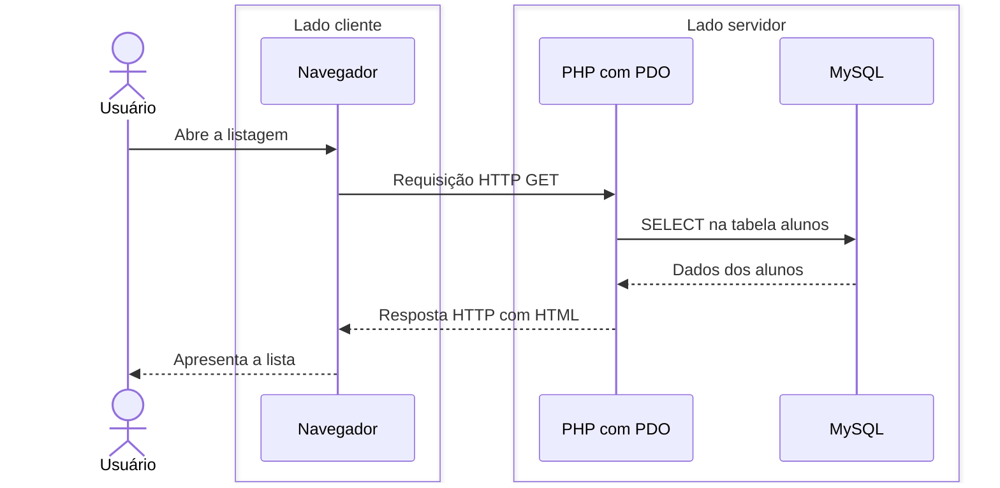

# CRUD com PHP e PDO: cadastro de alunos

Um sistema de informações precisa manter seus dados: cadastrar alunos, consultar uma turma, corrigir um e-mail ou excluir um registro. Essas operações formam um **CRUD**.

Nesta apostila, vamos ligar o PHP ao MySQL e acompanhar cada operação. Usaremos uma tabela de alunos e trechos pequenos de PHP, HTML e SQL. A leitura pressupõe os fundamentos da [apostila de PHP](../05-php/).

## Índice

1. [O que é CRUD?](#1-o-que-é-crud)
2. [O caminho entre o usuário e o banco](#2-o-caminho-entre-o-usuário-e-o-banco)
3. [O mínimo de MySQL e SQL](#3-o-mínimo-de-mysql-e-sql)
4. [Conectando o PHP com PDO](#4-conectando-o-php-com-pdo)
5. [Create: cadastrar um aluno](#5-create-cadastrar-um-aluno)
6. [Read: consultar os alunos](#6-read-consultar-os-alunos)
7. [Update: alterar um aluno](#7-update-alterar-um-aluno)
8. [Delete: excluir um aluno](#8-delete-excluir-um-aluno)
9. [Organização dos dois exemplos](#9-organização-dos-dois-exemplos)
10. [Quadro de consulta rápida](#10-quadro-de-consulta-rápida)

## 1. O que é CRUD?

CRUD reúne as iniciais de quatro operações:

| Letra | Operação | No cadastro de alunos | Comando SQL |
|---|---|---|---|
| C | **Create** — criar | Cadastrar um aluno | `INSERT` |
| R | **Read** — ler ou consultar | Listar alunos ou consultar um aluno | `SELECT` |
| U | **Update** — atualizar | Alterar nome ou e-mail | `UPDATE` |
| D | **Delete** — excluir | Remover um aluno | `DELETE` |

Essas operações aparecem em sistemas escolares, lojas, bibliotecas e muitos outros sistemas. Os dados mudam, mas a necessidade de cadastrá-los, consultá-los e mantê-los atualizados permanece.

O banco de dados mantém as informações depois que a requisição termina. Uma variável PHP existe durante a execução do programa; um aluno gravado no MySQL pode ser consultado novamente em outra visita à página. Esse armazenamento duradouro é chamado de **persistência**.

CRUD descreve operações sobre os dados. Não exige um framework nem uma organização específica de pastas.

## 2. O caminho entre o usuário e o banco

O navegador apresenta a interface; o PHP executa no servidor e conversa com o banco.

| Parte | Responsabilidade |
|---|---|
| Usuário | Preenche campos e aciona links ou botões |
| Navegador — lado cliente / front-end | Apresenta o HTML e envia requisições HTTP |
| PHP — lado servidor / back-end | Recebe os dados, realiza o processamento e prepara a resposta |
| PDO — usado pelo PHP | Permite conectar ao banco e executar comandos SQL |
| MySQL — lado servidor | Armazena os registros e executa os comandos SQL recebidos |

Este é o fluxo de uma consulta:



O navegador não envia SQL diretamente ao MySQL. Ele faz uma requisição HTTP ao servidor PHP; o PHP usa PDO para acessar o banco. A comunicação com o MySQL utiliza a conexão de banco de dados, não a requisição HTTP do navegador.

Após cadastrar, alterar ou excluir, o PHP pode responder com um **redirecionamento**. O navegador então faz outra requisição para carregar a listagem atualizada.

Mesmo quando tudo executa no computador do aluno, navegador, servidor PHP e MySQL continuam tendo funções diferentes.

## 3. O mínimo de MySQL e SQL

Usaremos um banco chamado `crud_alunos`, com uma tabela chamada `alunos`:

| Coluna | Conteúdo |
|---|---|
| `id` | Número que identifica cada aluno |
| `nome` | Nome do aluno |
| `email` | E-mail do aluno |

Uma **tabela** organiza dados em colunas e linhas. Cada linha, também chamada de **registro**, representa um aluno. O `id` permite indicar exatamente qual registro consultar, alterar ou excluir, mesmo quando dois alunos têm o mesmo nome.

**SQL** é a linguagem usada para dar instruções ao banco. Neste primeiro contato, vamos usar comandos prontos e observar sua finalidade.

### Entrando no MySQL

Com o ambiente do [guia de Web 1](../../apoio/ambiente-web1-windows/) preparado, abra o **CMD** e execute:

```bat
mysql -u root -p
```

`-u root` indica o usuário. `-p` solicita a senha configurada na instalação. Depois de entrar, o prompt passa a mostrar `mysql>`.

No console do MySQL, os comandos básicos são:

| Comando | Finalidade |
|---|---|
| `SHOW DATABASES;` | Listar os bancos existentes |
| `USE crud_alunos;` | Selecionar o banco que será usado |
| `SHOW TABLES;` | Listar as tabelas do banco selecionado |
| `DESCRIBE alunos;` | Mostrar as colunas e os tipos da tabela |
| `SELECT * FROM alunos;` | Consultar os alunos cadastrados |
| `EXIT;` | Sair do console MySQL |

Use `;` para finalizar cada instrução SQL. Se aparecer `->` no console, o MySQL está aguardando a continuação da instrução.

### SQL pronto para criar o banco

Este será o conteúdo de `banco.sql` nos exemplos. Por enquanto, também é possível copiar o bloco para o console MySQL:

```sql
CREATE DATABASE crud_alunos;
USE crud_alunos;

CREATE TABLE alunos (
    id INT AUTO_INCREMENT PRIMARY KEY,
    nome VARCHAR(100),
    email VARCHAR(150)
);
```

- `CREATE DATABASE` cria o banco; `CREATE TABLE` cria a tabela.
- `INT` representa um número inteiro.
- `AUTO_INCREMENT` gera o próximo número de identificação automaticamente.
- `PRIMARY KEY` define a coluna que identifica cada registro.
- `VARCHAR(100)` guarda texto com até 100 caracteres.

Crie esse banco uma vez. As duas versões do exemplo usarão a mesma tabela. A tabela começa vazia; os alunos serão inseridos pelo cadastro.

Quando o arquivo `banco.sql` estiver disponível, abra o CMD na pasta dele, entre no MySQL e execute:

```sql
SOURCE banco.sql;
```

`SOURCE` é um comando do cliente MySQL que executa as instruções de um arquivo. [MySQL — Comandos do cliente](https://dev.mysql.com/doc/refman/8.4/en/mysql-commands.html).

### Quatro comandos para reconhecer

```sql
INSERT INTO alunos (nome, email) VALUES ('Ana', 'ana@example.com');
SELECT * FROM alunos;
UPDATE alunos SET nome = 'Ana Silva' WHERE id = 1;
DELETE FROM alunos WHERE id = 1;
```

São demonstrações independentes de cadastro, consulta, alteração e exclusão. `*` significa todas as colunas. `WHERE id = 1` limita a operação ao aluno de identificação `1`.

**O `WHERE` é essencial para escolher o registro na alteração e na exclusão.** Sem ele, `UPDATE` e `DELETE` atuam sobre todas as linhas da tabela. Nas próximas seções, o `id` virá do link ou do formulário.

## 4. Conectando o PHP com PDO

**PDO** é um recurso do PHP para acessar bancos de dados. Vamos utilizá-lo com MySQL, por meio da extensão `pdo_mysql`, já indicada no guia de ambiente.

O arquivo reutilizável `conexao.php` terá apenas a criação da conexão:

```php
<?php
$pdo = new PDO(
    'mysql:host=localhost;dbname=crud_alunos;charset=utf8mb4',
    'root',
    'SUA_SENHA'
);
```

| Parte | Significado |
|---|---|
| `mysql` | Tipo de banco utilizado |
| `host=localhost` | MySQL no próprio computador |
| `dbname=crud_alunos` | Banco que será acessado |
| `charset=utf8mb4` | Codificação da conexão, para trabalhar com textos e acentos |
| `root` | Usuário do MySQL usado no ambiente local |
| `SUA_SENHA` | Substituir pela senha local desse usuário |

Guarde a senha real somente na sua cópia local. Para reutilizar o arquivo em outro projeto, ajuste o banco e os dados de conexão.

`new PDO(...)` cria o objeto que representa a conexão, guardado em `$pdo`. A conexão é encerrada automaticamente quando o script termina. [Manual do PHP — Conexões PDO](https://www.php.net/manual/pt_BR/pdo.connections.php).

Em uma página na mesma pasta, use:

```php
require 'conexao.php';
```

Nos trechos das próximas seções, considere que essa linha já foi executada antes de acessar `$pdo`.

### Como ler os comandos PDO

```php
$comando = $pdo->prepare('INSERT INTO alunos (nome, email) VALUES (?, ?)');
$comando->execute(['Ana', 'ana@example.com']);
```

O símbolo `->` chama uma operação do objeto. `prepare()` prepara o SQL; cada `?` reserva o lugar de um valor. `execute()` executa o comando com os valores do array, **na mesma ordem dos `?`**.

Assim, nome e e-mail são fornecidos separadamente do texto SQL. Não é necessário montar o comando juntando o conteúdo dos campos dentro de aspas. [Manual do PHP — prepare](https://www.php.net/manual/pt_BR/pdo.prepare.php) e [execute](https://www.php.net/manual/pt_BR/pdostatement.execute.php).

## 5. Create: cadastrar um aluno

Cadastrar significa acrescentar uma linha à tabela. O banco gera o `id`; o formulário envia nome e e-mail.

### Formulário

```html
<form method="post">
    Nome: <input name="nome">
    E-mail: <input name="email">
    <button>Salvar</button>
</form>
```

Sem `action`, o formulário envia os dados para a própria URL. Os atributos `name` definem as chaves que o PHP lerá em `$_POST`.

### Gravação

```php
$comando = $pdo->prepare('INSERT INTO alunos (nome, email) VALUES (?, ?)');
$comando->execute([$_POST['nome'], $_POST['email']]);
```

`INSERT INTO alunos` indica a tabela. `(nome, email)` indica as colunas preenchidas, e `VALUES (?, ?)` indica os dois valores que serão inseridos.

### Quando o formulário e o processamento ficam no mesmo arquivo

Na primeira versão, `create.php` será aberto para mostrar o formulário e receberá o envio. Antes do HTML, a parte de processamento seguirá esta ideia:

```php
if ($_POST) {
    $comando = $pdo->prepare('INSERT INTO alunos (nome, email) VALUES (?, ?)');
    $comando->execute([$_POST['nome'], $_POST['email']]);
    header('Location: index.php', true, 303);
    exit;
}
```

Nesse formulário, `if ($_POST)` distingue a abertura da página do envio dos campos. O `header()` redireciona para a listagem e `exit` encerra a execução. Esse processamento fica antes do HTML porque o redirecionamento precisa ser enviado antes da saída da página.

### Fluxo do cadastro

1. O usuário abre `create.php`; o navegador envia **GET** e recebe o formulário HTML.
2. Ao clicar em Salvar, o navegador envia **POST** com nome e e-mail.
3. No servidor, o PHP lê `$_POST` e usa PDO para executar **INSERT** no MySQL.
4. O PHP responde com **303**; o navegador faz um novo **GET** para `index.php` e recebe a listagem atualizada.

## 6. Read: consultar os alunos

Consultar pode significar listar todos os alunos ou buscar apenas um. O SQL utilizado é `SELECT`.

### Listar todos

```php
$consulta = $pdo->query('SELECT * FROM alunos');
$alunos = $consulta->fetchAll(PDO::FETCH_ASSOC);
```

`query()` executa diretamente esse SQL fixo. `fetchAll()` devolve as linhas encontradas. `PDO::FETCH_ASSOC` faz cada linha ser um array associativo, com chaves como `id`, `nome` e `email`.

O PHP pode percorrer os dados e gerar uma tabela:

```php
<table>
    <tr><th>ID</th><th>Nome</th><th>E-mail</th></tr>
    <?php foreach ($alunos as $aluno): ?>
        <tr>
            <td><?= $aluno['id'] ?></td>
            <td><?= $aluno['nome'] ?></td>
            <td><?= $aluno['email'] ?></td>
        </tr>
    <?php endforeach; ?>
</table>
```

Cada repetição cria uma linha de HTML. O navegador recebe a tabela pronta, não o `foreach` nem os arrays PHP. [Manual do PHP — fetchAll](https://www.php.net/manual/pt_BR/pdostatement.fetchall.php).

### Consultar apenas um aluno

Em uma URL como `update.php?id=3`, o PHP recebe `3` em `$_GET['id']`:

```php
$consulta = $pdo->prepare('SELECT * FROM alunos WHERE id = ?');
$consulta->execute([$_GET['id']]);
$aluno = $consulta->fetch(PDO::FETCH_ASSOC);
```

`fetch()` busca uma linha; `fetchAll()` busca todas as linhas do resultado. A consulta por `id` será usada para preencher o formulário de edição.

### Fluxo da consulta

1. O usuário abre a listagem ou seleciona um aluno; o navegador envia **GET**.
2. O PHP executa **SELECT** no MySQL usando PDO.
3. O MySQL devolve os dados ao PHP, que prepara o HTML.
4. O servidor responde ao navegador, que apresenta a lista ou os dados do aluno.

## 7. Update: alterar um aluno

Alterar um aluno envolve dois momentos: buscar os dados atuais e enviar os novos valores.

Na listagem, dentro do `foreach`, o link pode carregar o `id`:

```php
<a href="update.php?id=<?= $aluno['id'] ?>">Editar</a>
```

Depois do `SELECT` por `id` mostrado na seção anterior, o formulário usa os dados encontrados:

```php
<form method="post">
    <input type="hidden" name="id" value="<?= $aluno['id'] ?>">
    Nome: <input name="nome" value="<?= $aluno['nome'] ?>">
    E-mail: <input name="email" value="<?= $aluno['email'] ?>">
    <button>Salvar alterações</button>
</form>
```

`value` preenche os campos. O campo `hidden` envia o `id` junto com nome e e-mail, sem apresentá-lo como um campo de digitação.

O processamento do envio usa:

```php
$comando = $pdo->prepare('UPDATE alunos SET nome = ?, email = ? WHERE id = ?');
$comando->execute([$_POST['nome'], $_POST['email'], $_POST['id']]);
```

`SET` define os novos valores das colunas. `WHERE id = ?` escolhe o aluno que será alterado. Observe a ordem: nome, e-mail e, por último, `id`.

Na versão com tudo em `update.php`, o bloco `if ($_POST)` ficará antes da consulta e do formulário. Após atualizar, o PHP redirecionará para `index.php`, como no cadastro. A alteração mantém o mesmo `id`; ela não cria outro aluno.

### Fluxo da alteração

1. O usuário clica em Editar; o navegador envia **GET** com o `id`.
2. O PHP executa **SELECT**, monta o formulário preenchido e o envia ao navegador.
3. O usuário altera os campos; o navegador envia **POST** com `id`, nome e e-mail.
4. O PHP executa **UPDATE**, responde com **303**, e o navegador abre a listagem por **GET**.

## 8. Delete: excluir um aluno

Excluir significa remover uma linha da tabela. O PHP precisa receber o `id` do aluno escolhido.

No primeiro exemplo, o link de exclusão ficará na listagem, dentro do `foreach`:

```php
<a href="index.php?excluir=<?= $aluno['id'] ?>">Excluir</a>
```

No início de `index.php`, antes da consulta de listagem e do HTML:

```php
if (isset($_GET['excluir'])) {
    $comando = $pdo->prepare('DELETE FROM alunos WHERE id = ?');
    $comando->execute([$_GET['excluir']]);
    header('Location: index.php', true, 303);
    exit;
}
```

`isset($_GET['excluir'])` identifica que o parâmetro de exclusão veio na URL. Depois de excluir, o redirecionamento volta para `index.php` sem esse parâmetro, para exibir a lista novamente.

O link faz uma requisição **GET**; `DELETE` é o comando **SQL** executado pelo PHP. Usar o link dessa forma é uma simplificação do primeiro exemplo. No segundo, um pequeno formulário com **POST** enviará o `id` para `delete_action.php`, pois a exclusão modifica os dados.

### Fluxo da exclusão

1. O usuário escolhe Excluir; o navegador envia o `id` ao servidor — por **GET** no primeiro exemplo e por **POST** no segundo.
2. O PHP usa PDO para executar **DELETE** com o `id` recebido.
3. O MySQL remove a linha, e o PHP responde ao navegador com um redirecionamento **303**.
4. O navegador faz **GET** para a listagem; o PHP consulta os alunos restantes e devolve o HTML atualizado.

## 9. Organização dos dois exemplos

**Os arquivos dos exemplos serão criados nas próximas iterações.** Os trechos desta apostila apresentam os conceitos; as estruturas abaixo descrevem as duas versões que serão disponibilizadas na pasta `exemplos`.

As duas versões usarão o mesmo banco, as mesmas colunas e as mesmas operações SQL.

### Exemplo 1 — CRUD mínimo

Pasta prevista: `exemplos/01-crud-minimo/`.

Serão três arquivos de páginas, mais a conexão e o SQL, todos na mesma pasta:

| Arquivo | Responsabilidade |
|---|---|
| `index.php` | Listar alunos, oferecer o link para cadastrar e os links de editar/excluir; processar a exclusão |
| `create.php` | Mostrar o formulário e processar o cadastro no mesmo arquivo |
| `update.php` | Buscar o aluno, mostrar o formulário preenchido e processar a alteração |
| `conexao.php` | Criar a conexão PDO reutilizada pelas páginas |
| `banco.sql` | Criar o banco e a tabela |

O HTML conterá apenas os elementos necessários ao funcionamento, sem CSS, metatags ou `label`. Os formulários e seus processamentos ficarão juntos para tornar o percurso dos dados fácil de acompanhar.

### Exemplo 2 — CRUD com templates e actions

Pasta prevista: `exemplos/02-crud-templates/`.

Uma **view** apresenta o formulário ou os dados. Uma **action** é o arquivo PHP que recebe uma operação e a executa. Separar esses arquivos permite localizar com facilidade o HTML e o processamento.

| Caminho previsto | Responsabilidade |
|---|---|
| `php/index.php` | Home com uma breve apresentação do exemplo |
| `php/conexao.php` | Conexão PDO compartilhada |
| `php/templates/cabecalho.php` | Início da página e carregamento do Tailwind pelo CDN |
| `php/templates/menu.php` | Links Home e Alunos |
| `php/templates/rodape.php` | Rodapé e fechamento da página |
| `php/alunos/index.php` | Listagem e consulta de um aluno |
| `php/alunos/create_view.php` | Formulário de cadastro |
| `php/alunos/create_action.php` | Executar o INSERT e redirecionar |
| `php/alunos/update_view.php` | Consultar o aluno e apresentar o formulário de edição |
| `php/alunos/update_action.php` | Executar o UPDATE e redirecionar |
| `php/alunos/delete_action.php` | Receber o id por POST, executar o DELETE e redirecionar |
| `sql/banco.sql` | Script de criação do banco e da tabela |
| `css/` e `js/` | Pastas reservadas para estilos e scripts próprios, quando necessários |

As páginas usarão `include` para reaproveitar cabeçalho, menu e rodapé. Em uma página dentro de `php/alunos/`, por exemplo:

```php
<?php include '../templates/cabecalho.php'; ?>
<?php include '../templates/menu.php'; ?>

<h1>Alunos</h1>

<?php include '../templates/rodape.php'; ?>
```

`../` sobe uma pasta. Nessa mesma localização, a conexão será incluída com `require '../conexao.php';`. Na home, que estará em `php/`, os caminhos dos templates começarão por `templates/`.

Para enviar um formulário a outro arquivo, basta indicar a action:

```html
<form action="create_action.php" method="post">
    Nome: <input name="nome">
    E-mail: <input name="email">
    <button>Salvar</button>
</form>
```

As actions farão o processamento e o redirecionamento. Os templates serão usados nas páginas que apresentam HTML, depois dos comandos PHP que precisem preparar cabeçalhos HTTP.

O Tailwind via CDN fornecerá poucas classes para espaçamento, cores e apresentação dos botões. A lógica do CRUD continuará sendo PHP e SQL, e o funcionamento básico não precisará de JavaScript.

## 10. Quadro de consulta rápida

| Preciso… | Usarei… |
|---|---|
| Abrir o console MySQL | `mysql -u root -p` |
| Selecionar o banco | `USE crud_alunos;` |
| Carregar a conexão no PHP | `require 'conexao.php';` |
| Executar uma consulta SQL fixa | `$pdo->query(...)` |
| Executar SQL com valores do formulário ou da URL | `prepare()` e `execute([...])` |
| Obter uma lista de registros | `fetchAll(PDO::FETCH_ASSOC)` |
| Obter um registro | `fetch(PDO::FETCH_ASSOC)` |
| Apresentar uma lista em HTML | `foreach` |
| Escolher qual aluno alterar ou excluir | `WHERE id = ?` |
| Voltar à listagem após uma operação | `header('Location: index.php', true, 303);` seguido de `exit;` |

Para executar as páginas PHP, abra o CMD na pasta que contém a página inicial e use:

```bat
php -S localhost:8000
```

Abra [http://localhost:8000](http://localhost:8000) no navegador. No primeiro exemplo, o servidor será iniciado na pasta do exemplo; no segundo, dentro de `php/`. O MySQL também precisa estar em execução: iniciar o servidor PHP não inicia o banco.

### O que você precisa guardar

- CRUD reúne cadastro, consulta, alteração e exclusão de dados.
- O navegador envia requisições HTTP; o PHP usa PDO para executar SQL no MySQL.
- O `id` identifica o aluno nas consultas, alterações e exclusões.
- `INSERT`, `SELECT`, `UPDATE` e `DELETE` realizam as quatro operações no banco.
- O PHP transforma o resultado da consulta em HTML para o navegador apresentar.
- Separar formulários, actions e templates muda a organização dos arquivos, mas as operações sobre os dados continuam as mesmas.

## Referências

- [PHP — Conexões PDO](https://www.php.net/manual/pt_BR/pdo.connections.php)
- [PHP — prepare](https://www.php.net/manual/pt_BR/pdo.prepare.php) e [execute](https://www.php.net/manual/pt_BR/pdostatement.execute.php)
- [PHP — fetch](https://www.php.net/manual/pt_BR/pdostatement.fetch.php) e [fetchAll](https://www.php.net/manual/pt_BR/pdostatement.fetchall.php)
- [MySQL — Comandos do cliente](https://dev.mysql.com/doc/refman/8.4/en/mysql-commands.html)
- [MySQL — Criação de tabelas](https://dev.mysql.com/doc/refman/8.4/en/creating-tables.html)
- [MySQL — INSERT](https://dev.mysql.com/doc/refman/8.4/en/insert.html), [UPDATE](https://dev.mysql.com/doc/refman/8.4/en/update.html) e [DELETE](https://dev.mysql.com/doc/refman/8.4/en/delete.html)
