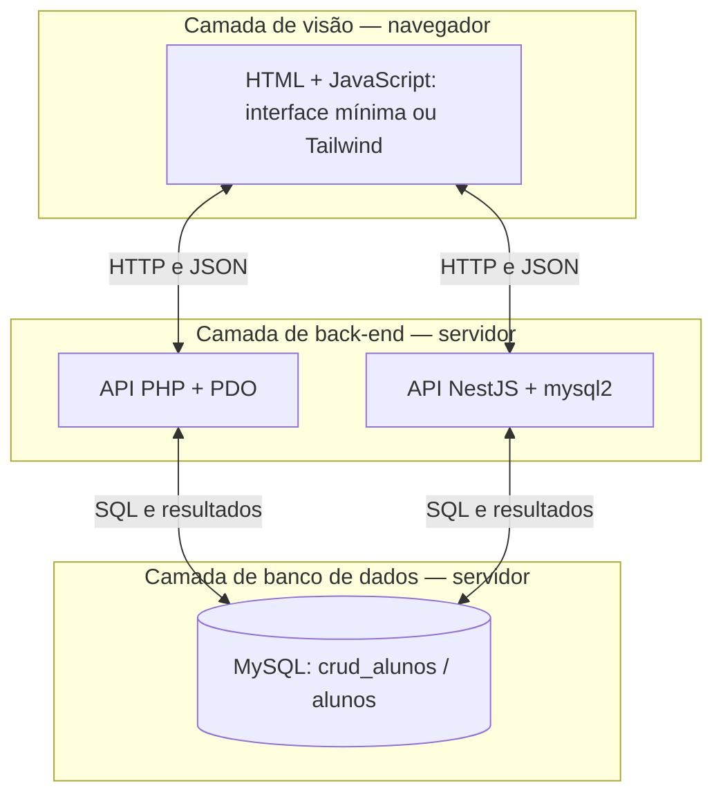
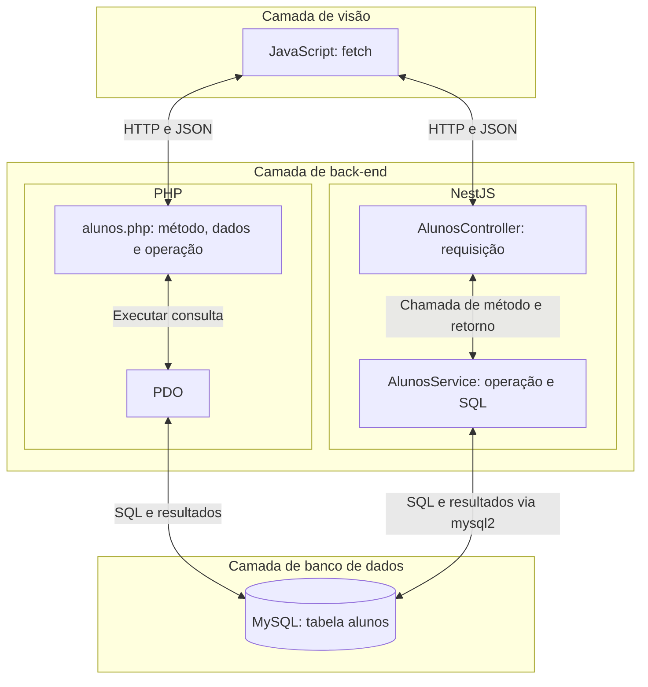

# CRUD com NestJS: mesma interface e mesmo banco

Um cadastro de alunos pode usar diferentes tecnologias no servidor e manter a mesma interface e os mesmos dados. Nesta apostila, o **NestJS** realiza o papel da API PHP do [exemplo 3 de CRUD](../06-crud-php/exemplos/03-crud-api/).

O foco está em reconhecer o que muda no back-end e o que permanece compatível: as operações HTTP, os dados em JSON, o front-end e o banco MySQL.

A leitura pressupõe o [CRUD com PHP](../06-crud-php/), o uso de [JavaScript e `fetch`](../04-javascript-dom/) e uma introdução a TypeScript. Os blocos de código são recortes didáticos; não formam, isoladamente, um projeto executável. A pasta `exemplo/` fica reservada para a implementação completa.

## Índice

1. [As três camadas da aplicação](#1-as-três-camadas-da-aplicação)
2. [O contrato que permite trocar o back-end](#2-o-contrato-que-permite-trocar-o-back-end)
3. [O básico de NestJS](#3-o-básico-de-nestjs)
4. [Controller: receber a requisição](#4-controller-receber-a-requisição)
5. [Service: acessar o mesmo banco](#5-service-acessar-o-mesmo-banco)
6. [Receber o id e os dados do formulário](#6-receber-o-id-e-os-dados-do-formulário)
7. [Registrar os componentes e iniciar o servidor](#7-registrar-os-componentes-e-iniciar-o-servidor)
8. [Reaproveitar os dois front-ends](#8-reaproveitar-os-dois-front-ends)
9. [Organização do exemplo e consulta rápida](#9-organização-do-exemplo-e-consulta-rápida)

## 1. As três camadas da aplicação

No exemplo 3, o navegador apresenta o cadastro; a API PHP recebe as requisições; o MySQL armazena os alunos. Com NestJS, essas responsabilidades permanecem:

| Camada | Exemplo com API PHP | Exemplo com API NestJS |
|---|---|---|
| **Visão / front-end** | HTML, JavaScript e, na versão estilizada, Tailwind | Os mesmos HTMLs e JavaScript, com o endereço da API ajustado |
| **Back-end** | PHP recebe HTTP, usa PDO e responde em JSON | NestJS recebe HTTP, usa `mysql2` e responde em JSON |
| **Banco de dados** | MySQL, banco `crud_alunos`, tabela `alunos` | O mesmo banco e a mesma tabela |

### Duas implementações, a mesma interface e o mesmo banco



Os dois caminhos representam alternativas de back-end. A interface usa o endereço configurado no JavaScript; ela não envia cada operação para os dois servidores.

**A visão continua no navegador.** O JavaScript lê o formulário, chama a API e preenche a tabela. Os back-ends fornecem os dados em JSON; o navegador não recebe seu código-fonte nem acessa o MySQL diretamente.

Se as duas APIs apontam para a mesma instância do MySQL e para o banco `crud_alunos`, um aluno cadastrado pela API PHP também aparece em uma consulta pela API NestJS.

## 2. O contrato que permite trocar o back-end

O **contrato da API** descreve como fazer uma requisição e qual resposta esperar. Para reaproveitar o front-end, preservamos os métodos HTTP, o parâmetro `id` e o formato dos dados.

| Operação | Na API PHP | Na API NestJS | Resposta de sucesso |
|---|---|---|---|
| Listar | `GET /api/alunos.php` | `GET /api/alunos` | `200` e um array de alunos |
| Consultar um | `GET /api/alunos.php?id=1` | `GET /api/alunos?id=1` | `200` e um objeto aluno |
| Cadastrar | `POST /api/alunos.php` | `POST /api/alunos` | `201`, id gerado e mensagem |
| Alterar | `PUT /api/alunos.php?id=1` | `PUT /api/alunos?id=1` | `200` e mensagem |
| Excluir | `DELETE /api/alunos.php?id=1` | `DELETE /api/alunos?id=1` | `200` e mensagem |

`1` é apenas um exemplo de id. O cadastro e a alteração enviam os mesmos quatro campos no corpo JSON:

```json
{
    "nome": "Ana Souza",
    "email": "ana.souza@example.com",
    "data_nascimento": "2005-03-12",
    "telefone": "(11) 90000-0001"
}
```

Nas consultas, cada aluno também contém `id`. A lista mantém a ordem `ORDER BY id DESC` usada no PHP. As respostas de cadastro, alteração e exclusão mantêm a propriedade **`mensagem`**, lida pelo JavaScript:

```json
{
    "id": 9,
    "mensagem": "Aluno cadastrado."
}
```

O id acima é ilustrativo; quem o gera é o MySQL. A consulta de um aluno inexistente responde com `404`.

A extensão `.php` identifica o arquivo da API anterior. No NestJS, `/api/alunos` é uma **rota**, isto é, um caminho atendido pela aplicação. Não é necessário existir um arquivo chamado `alunos` nessa localização.

## 3. O básico de NestJS

**NestJS** é um framework para organizar aplicações de servidor. Neste cadastro, ele recebe requisições HTTP e entrega respostas em JSON.

| Tecnologia | Papel |
|---|---|
| **TypeScript** | Linguagem utilizada para escrever o back-end |
| **Node.js** | Ambiente que executa o JavaScript produzido a partir do TypeScript |
| **NestJS** | Framework que organiza os componentes e o atendimento das requisições |
| **mysql2** | Biblioteca utilizada pelo back-end para conversar com o MySQL |

Os arquivos TypeScript usam a extensão `.ts`. A ferramenta de compilação produz JavaScript para execução no Node.js. O front-end continua escrito em JavaScript para o navegador.

O cadastro usa três componentes básicos:

- **Controller:** recebe a requisição e escolhe a operação.
- **Service:** executa as operações sobre os alunos, incluindo o SQL.
- **Module:** registra os componentes utilizados pela aplicação.

### A organização dentro de cada back-end



No PHP, `alunos.php` reúne a escolha da operação e o SQL. No NestJS, o controller encaminha o trabalho ao service. Essa divisão organiza o código; as operações no banco continuam sendo `SELECT`, `INSERT`, `UPDATE` e `DELETE`.

O módulo registra os componentes. Ele não é uma etapa percorrida pelos dados entre controller e service.

## 4. Controller: receber a requisição

Uma **rota** associa um método HTTP e um caminho a uma operação. Um **decorador** é uma anotação que informa ao Nest como interpretar uma classe ou um método.

Este primeiro trecho devolve dados fixos, apenas para mostrar a definição de uma rota:

```typescript
import { Controller, Get } from '@nestjs/common';

@Controller('api/alunos')
export class AlunosController {
    @Get()
    listar() {
        return [{ id: 1, nome: 'Ana' }];
    }
}
```

- `import` traz os recursos utilizados no arquivo.
- `@Controller('api/alunos')` define o caminho base.
- `@Get()` associa `listar()` ao método HTTP GET nesse caminho.
- `export` permite usar a classe em outro arquivo.

Com o controller registrado no módulo, `GET /api/alunos` chama `listar()`. Ao retornar um objeto ou array, o Nest prepara o JSON da resposta. Esse array fixo demonstra a rota; a consulta real usa os dados do banco apresentados a seguir.

No PHP, a escolha aparece em uma condição como `if ($metodo === 'GET')`. No Nest, cada método do controller recebe o decorador da operação:

| Decorador | Operação neste cadastro |
|---|---|
| `@Get()` | Listar ou consultar um aluno |
| `@Post()` | Cadastrar |
| `@Put()` | Alterar |
| `@Delete()` | Excluir |

O retorno normal usa status `200`; métodos com `@Post()` usam `201` por padrão.

## 5. Service: acessar o mesmo banco

O banco permanece `crud_alunos`, com a tabela `alunos` e as colunas `id`, `nome`, `email`, `data_nascimento` e `telefone`. Se essa estrutura já existe, ela pode ser reutilizada com os registros atuais.

### Conexão

Em `conexao.ts`, a biblioteca `mysql2` permite centralizar a configuração:

```typescript
import { createPool } from 'mysql2/promise';

export const banco = createPool({
    host: '127.0.0.1',
    port: 3306,
    user: 'root',
    password: 'SUA_SENHA',
    database: 'crud_alunos',
    charset: 'utf8mb4',
    dateStrings: ['DATE'],
});
```

`createPool()` cria um conjunto de conexões reutilizadas pela aplicação. Host, porta, usuário, senha e banco correspondem aos valores de `conexao.php`. A senha real fica somente na configuração local do servidor.

**`dateStrings: ['DATE']` mantém a data como texto `AAAA-MM-DD`.** Esse é o formato usado pelo campo de nascimento da interface. O telefone também permanece texto.

### Listar alunos

Em `alunos.service.ts`, o service executa o mesmo SQL da API PHP:

```typescript
import { Injectable } from '@nestjs/common';
import { banco } from './conexao';

@Injectable()
export class AlunosService {
    async listar() {
        const [alunos] = await banco.execute(
            'SELECT * FROM alunos ORDER BY id DESC'
        );
        return alunos;
    }
}
```

`@Injectable()` permite que o Nest forneça esse service a outros componentes. `execute()` devolve os dados e informações sobre o resultado; `const [alunos]` guarda a primeira parte, que contém as linhas da consulta.

O acesso ao banco é assíncrono. **`async`** indica um método que devolve uma Promise; **`await`** aguarda o resultado daquela operação antes de continuar o método. Isso não bloqueia todo o servidor.

### Conectar o controller ao service

O controller recebe o service pelo construtor e usa seu método:

```typescript
import { Controller, Get } from '@nestjs/common';
import { AlunosService } from './alunos.service';

@Controller('api/alunos')
export class AlunosController {
    constructor(private alunos: AlunosService) {}

    @Get()
    listar() {
        return this.alunos.listar();
    }
}
```

`private alunos: AlunosService` guarda o service na propriedade `alunos`. O Nest fornece a instância conforme o registro no módulo; esse mecanismo é chamado de **injeção de dependências**.

O controller pode retornar a Promise recebida do service: o Nest aguarda seu resultado para preparar a resposta.

O percurso da listagem é: requisição GET → controller → service → consulta SQL → resultado em JSON → tabela preenchida pelo JavaScript.

## 6. Receber o id e os dados do formulário

Os trechos abaixo são métodos do controller. Eles encaminham as operações ao service; a implementação completa desses métodos do service pertence ao exemplo.

### Id pela URL

O mesmo GET atende a lista e a consulta individual. No controller conectado ao service, substitua o método `listar()` por:

```typescript
@Get()
consultar(@Query('id') id?: string) {
    if (id !== undefined) {
        return this.alunos.buscar(id);
    }
    return this.alunos.listar();
}
```

Acrescente `Query` aos imports de `@nestjs/common`. `@Query('id')` lê o parâmetro de uma URL como `/api/alunos?id=1`. O `?` em `id?: string` indica que o parâmetro pode estar ausente.

O id chega como texto. Uma anotação de tipo não converte o valor recebido. Neste exemplo, ele é fornecido como parâmetro da consulta `WHERE id = ?`.

### Dados pelo corpo JSON

Um tipo simples descreve os campos do cadastro. Ele pode ficar em `aluno.ts`:

```typescript
export type DadosAluno = {
    nome: string;
    email: string;
    data_nascimento: string;
    telefone: string;
};
```

O tipo descreve os dados durante a escrita e a compilação do código; não valida automaticamente a requisição HTTP. A data permanece `string` porque o formulário envia `AAAA-MM-DD`.

No controller, importe `Post` e `Body` de `@nestjs/common` e o tipo com `import type { DadosAluno } from './aluno';`:

```typescript
@Post()
cadastrar(@Body() dados: DadosAluno) {
    return this.alunos.cadastrar(dados);
}
```

`@Body()` recebe o corpo JSON já interpretado. No PHP, o mesmo trabalho começa com a leitura de `php://input` e `json_decode()`.

### Alterar e excluir

Com `Put` e `Delete` também importados de `@nestjs/common`, os métodos mantêm a mesma forma de receber o id:

```typescript
@Put()
alterar(@Query('id') id: string, @Body() dados: DadosAluno) {
    return this.alunos.alterar(id, dados);
}

@Delete()
excluir(@Query('id') id: string) {
    return this.alunos.excluir(id);
}
```

As consultas do service seguem as operações já conhecidas:

| Método do service | SQL e resultado |
|---|---|
| `listar()` | `SELECT` de todos os alunos; devolve um array |
| `buscar(id)` | `SELECT ... WHERE id = ?`; devolve um aluno ou responde com `404` |
| `cadastrar(dados)` | `INSERT` dos quatro campos; devolve id gerado e mensagem |
| `alterar(id, dados)` | `UPDATE ... WHERE id = ?`; devolve mensagem |
| `excluir(id)` | `DELETE ... WHERE id = ?`; devolve mensagem |

Assim como no PDO, os valores são enviados separadamente do texto SQL, nos lugares marcados por `?`. O formulário mantém seus atributos `required`; os trechos concentram-se no percurso dos dados.

## 7. Registrar os componentes e iniciar o servidor

Em `app.module.ts`, o módulo principal registra o controller e o service:

```typescript
import { Module } from '@nestjs/common';
import { AlunosController } from './alunos.controller';
import { AlunosService } from './alunos.service';

@Module({
    controllers: [AlunosController],
    providers: [AlunosService],
})
export class AppModule {}
```

`controllers` indica as classes que atendem às requisições. `providers` registra os componentes que o Nest pode fornecer, como o service.

Em `main.ts`, a aplicação é criada a partir desse módulo:

```typescript
import { NestFactory } from '@nestjs/core';
import { AppModule } from './app.module';

async function iniciar() {
    const app = await NestFactory.create(AppModule);
    await app.listen(3000);
}

iniciar();
```

`3000` é a porta HTTP desse servidor. `3306`, na configuração da conexão, é a porta do MySQL. Iniciar a aplicação Nest não inicia o banco.

O projeto completo reúne esses arquivos, as dependências e a configuração de compilação. Para executá-lo, são necessários Node.js, npm e MySQL.

## 8. Reaproveitar os dois front-ends

As duas interfaces do exemplo PHP carregam o mesmo `js/app.js`. Ambas possuem os ids e atributos utilizados pelo script para ler o formulário e preencher os dados.

No front-end associado ao NestJS, a mudança fica no endereço da API:

```javascript
// Endereço na versão PHP:
const api = "../api/alunos.php";
```

```javascript
// Endereço na versão NestJS:
const api = "../api/alunos";
```

São alternativas: cada arquivo usa apenas uma dessas declarações. As chamadas continuam utilizando `fetch(api)` e `fetch(api + "?id=" + id)`, com os mesmos métodos HTTP e os mesmos campos.

O nome `mensagem` também é preservado, porque o JavaScript acessa `resposta.mensagem`. Retornar a lista dentro de outra propriedade, como `{ dados: [...] }`, exigiria alterar o script.

### Um servidor para os arquivos e a API

Na organização do exemplo NestJS, os dois HTMLs e `js/app.js` ficam dentro de uma pasta `public/`, mantendo suas posições relativas. O Nest com Express pode disponibilizar essa pasta como arquivos estáticos.

| Endereço no servidor NestJS | Conteúdo |
|---|---|
| `/frontend-minimo/` | Interface mínima |
| `/frontend-tailwind/` | Interface com Tailwind |
| `/js/app.js` | JavaScript compartilhado |
| `/api/alunos` | API atendida pelo controller |

Entregar os arquivos estáticos significa enviar HTML e JavaScript ao navegador. Atender a API significa executar o controller e preparar o JSON. Mesmo usando um servidor, essas responsabilidades continuam distintas.

A configuração de arquivos estáticos complementa a inicialização mostrada na seção anterior. Com páginas e API no mesmo endereço de servidor e porta, as chamadas relativas funcionam sem configuração de CORS.

### Comparar o funcionamento

Com as duas implementações em execução e conectadas ao mesmo banco:

1. Abra a interface da versão PHP e cadastre um aluno.
2. Abra a interface da versão NestJS e atualize a lista.
3. Confira o mesmo id e os mesmos dados.
4. Edite o aluno pela versão NestJS.
5. Atualize a lista na versão PHP e confira a alteração.

Em **F12 → Rede/Network → Fetch/XHR**, compare método, corpo JSON, status e resposta. A tecnologia do servidor muda; os dados utilizados pela interface permanecem compatíveis.

## 9. Organização do exemplo e consulta rápida

A organização prevista para o projeto completo na pasta `exemplo/` é:

| Caminho | Responsabilidade |
|---|---|
| `src/main.ts` | Iniciar o servidor e configurar os arquivos estáticos |
| `src/app.module.ts` | Registrar controller e service |
| `src/alunos.controller.ts` | Receber as operações HTTP |
| `src/alunos.service.ts` | Executar SQL e preparar os resultados |
| `src/conexao.ts` | Configurar o acesso ao MySQL |
| `src/aluno.ts` | Descrever os campos recebidos |
| `public/frontend-minimo/index.html` | Interface mínima reaproveitada |
| `public/frontend-tailwind/index.html` | Interface Tailwind reaproveitada |
| `public/js/app.js` | Script compartilhado com o endereço da API ajustado |
| `package.json` e `tsconfig.json` | Dependências, comandos e configuração do TypeScript |

O banco e os dados de teste seguem os [scripts SQL do exemplo PHP](../06-crud-php/exemplos/03-crud-api/sql/). Não é necessário recriar um banco já preparado. Reexecutar `popular.sql` acrescenta novamente os alunos fictícios.

### Correspondência com PHP

| No exemplo PHP | No exemplo NestJS |
|---|---|
| Condição sobre `$_SERVER['REQUEST_METHOD']` | `@Get()`, `@Post()`, `@Put()` e `@Delete()` |
| `$_GET['id']` | `@Query('id')` |
| `php://input` e `json_decode()` | `@Body()` |
| PDO | Biblioteca `mysql2` |
| SQL com `?` e valores separados | SQL com `?` e valores separados |
| `json_encode()` | Retorno de objeto ou array pelo controller |
| `http_response_code(201)` no cadastro | Status `201` padrão de `@Post()` |
| Operações concentradas em `alunos.php` | Controller encaminha as operações ao service |

### O que você precisa guardar

- A interface apresenta os dados; o back-end recebe requisições e acessa o banco.
- PHP e NestJS podem oferecer as mesmas operações em JSON.
- O controller recebe a requisição; o service executa a operação; o módulo registra os componentes.
- O mesmo MySQL armazena os registros usados pelas duas implementações.
- Reaproveitar o front-end depende de preservar o contrato da API.
- Aqui, o ajuste no JavaScript é o endereço da API; os HTMLs permanecem compatíveis.

## Referências

- [NestJS — Primeiros passos](https://docs.nestjs.com/first-steps)
- [NestJS — Controllers](https://docs.nestjs.com/controllers)
- [NestJS — Providers e services](https://docs.nestjs.com/providers)
- [NestJS — Modules](https://docs.nestjs.com/modules)
- [NestJS — Arquivos estáticos com Express](https://docs.nestjs.com/techniques/mvc)
- [MySQL2 — Consultas, parâmetros e Promises](https://sidorares.github.io/node-mysql2/docs)
- [TypeScript — Tipos básicos](https://www.typescriptlang.org/docs/handbook/2/everyday-types.html)
